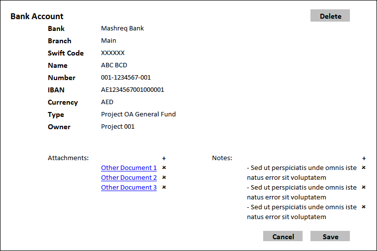

# Definition

Bank Account entity is used to capture all the bank accounts we interact in real life.

# Properties

Bank Account entity corresponds to “bank_accounts” collection in the database which has the following fields:

| Property  | Type   | Reference | Reference To | Description | Method
| ------    | ------ | ------    | ------       | ------      | ------
id|Int|PK|-|Unique Identifier|Auto generated
bank|Text|-|-|Name of the bank|User entry
branch|Text|-|-|Branch of the bank|User entry
swift_code|Text|-|-|Swift Code of the bank|User entry
name|Text|-|-|Name of the bank account|User entry
number|Text|-|-|Account Number|User entry
iban|Text|-|-|IBAN|User entry
type|Text|FK|Bank Account Type|Type of the bank account|Dropdown
isCurrent|Bool|-|-|-|Checkbox
contact|Int|FK|Contact|-|Searchable Dropdown
project|Int|FK|Project|-|Searchable Dropdown
landlord|Int|FK|Landlord|-|Searchable Dropdown
currency|Text|-|-|-|Searchable Dropdown

# Processes

## List

Bank Accounts are listed in a tabular format similar to the below screenshot:

Each field represented in the screenshot described in the Bank Account Properties section of this document. 

This UI component has a purpose of listing all the bank accounts recorded in the system database. When the bank accounts are listed as a subcomponent of another UI “Listing Bank Accounts as a Sub-Component”process should be used.

Bank accounts can be searched by Bank Name, Branch Name, Account Name, Account Number and IBAN number.

Bank accounts can be filtered by Bank Name, Type and recency fields.

Click action on any of the columns takes the user interface to the details of the bank account.

Click action on the “Create” button opens a modal screen and introduces the user with the “Create/Edit/View Bank Account” component.

## List as a Sub-Component

When a bank account listing is needed as a sub-component of another UI, below screenshot should be presented to the user.

Click action on the “(Unassign)” button triggers the “Unassign Bank Account” process.

Only the tuples marked with isCurrent as true will be listed on this UI.

## Create/Edit/View

Bank accounts are created in the system using a modal screen as shown above.

Bank: This is an autocomplete text field which offers to assign previously used bank names. <<TODO> Phase 2: Autocomplete is assigned as phase 2>

Branch: This is an autocomplete text field which offers to assign previously used branch names under the assigned bank account. <<TODO> Phase 2: Autocomplete is assigned as phase 2>

Swift Code: This is an autocomplete text field, when the bank name and branch name is provided offers the previously used swift codes for the bank. <<TODO> Phase 2: Autocomplete is assigned as phase 2>

Name: Text field represents the owner of the bank account.

Number: Text field represents the bank account number.

IBAN: Text field represents the IBAN number. <<TODO> Phase 2: IBAN number can be auto calculated using the Bank and Account number information. This becomes an autocomplete field.>

Currency: Text field.

Type: Dropdown reference to the “Bank Account Type” entity’s table’s tuples.

Owner: If the UI is displayed from the regular bank account listing UI, the owner should be displayed. If the UI is displayed from “Listing Bank Accounts as a Sub-Component” owner field will be hidden.

Esc button on the user’s keyboard cancels the process and returns to the parent component.

Click action on the “Cancel” button cancels the process and returns to the parent component.

Click action on the “Save” button will create a tuple on the bank_account table with the provided information with the below steps:

* Begin Transaction
* Insert the new tuple, isCurrent field should be automatically set to true.
* Retrieve the id of the new tuple
* If the same owner has the same type of acc ount, the older same typed accounts for the same owner will be updated as isCurrent assignment of false.
* Complete Transaction and return to the parent component.

Delete:
* If the component is called from “Listing Bank Accounts” component, this button reads as “Delete”. Click action triggers the “Deleting Bank Account” process.
* If the component is called from “Listing Bank Accounts as a Sub-Component” component, this button is hidden.

Notes about the bank account can be multiple and will be handled in the way that is described in the Note section of this document.

A bank account can have multiple documents, which can be uploaded using the method described in the Document section of this document.

## Delete

On the bank account details screen which is described in the “Create/Edit/View Bank Account” section of this document, top-right part of the UI provides a delete button. Click action to this button should trigger a confirmation and upon confirmation, the bank account should be deleted from the system database. Once the deletion process is complete, the screen should return to the previous state, in which, the modal screen is opened to view the details of the bank account.

## Unassign

“Listing Bank Accounts as a Sub-Component” component lists bank accounts for the given entity. When the “(Unassign)” button is clicked, the system will update the tuple to set the isCurrent field as false and refresh the listing UI.

