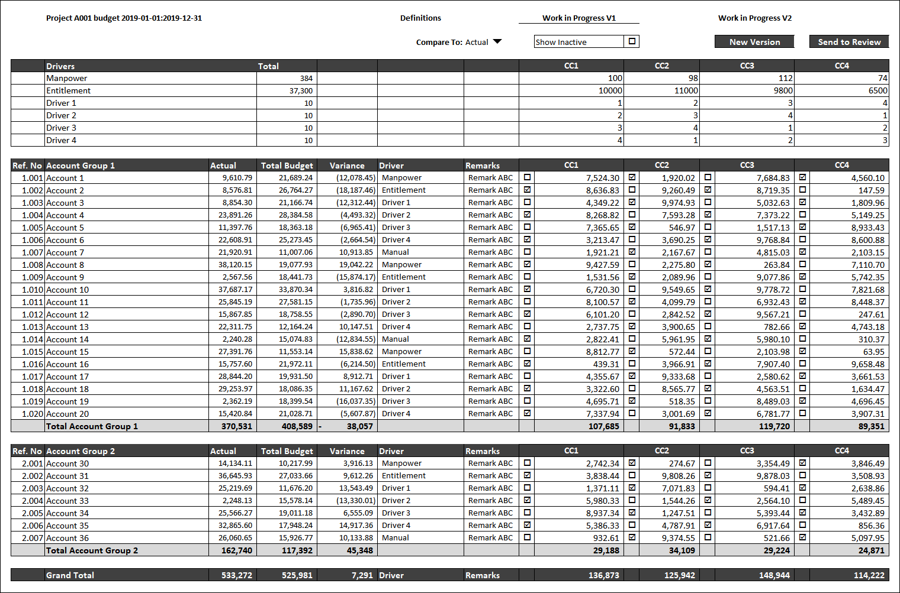
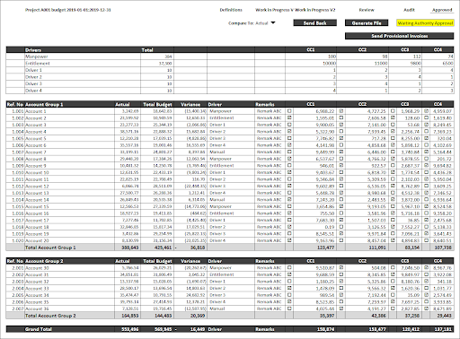

# Definition

Each project’s owner association performs a budget study annually. This budget is compiled into a file to be uploaded to the RERA (Real Estate Regulatory Agency)’s system, which is named Mollak. Our system will facilitate the budget preparation and generate an export file to be uploaded to Mollak system.

# Properties

Budget entity corresponds to “budget” table in the database which has the following fields:

| Property  | Type   | Reference | Reference To | Description | Method
| ------    | ------ | ------    | ------       | ------      | ------
id|Int|PK|-|Unique Identifier|Auto generated
budget_project|Int|FK|Project|Assigned project of the budget|Auto assignment
name|Text|-|-|Name of the Version of the budget|Auto assignment
start|Date|-|-|Start date of the budget|Date Picker
end|Date|-|-|End date of the budget|Date Picker
budget_previous|Int|FK|Budget|Previous budget to base budget|Searchable Dropdown
budget_status|Text|FK|Budget Status|-|Dropdown
budget_type|Text|FK|Budget Type|-|Dropdown
grace|Int|-|-|Grace period in number of days|User entry
overdue_percentage|Float|-|-|Overdue charge percentage|User entry
mollak_id|Text|-|-|-|User entry

# Processes

## List

Budgets are listed under the project screens Budgets tab. Each budget is identified and automatically named by the start and end dates. Budget listing should resemble the below design:

Click action on any of the cells in the data rows will open the budget details on a modal screen. Budget details modal screen should have width and height set as 95% of the viewport by passing the width and height to the dialog.open API.

## Create

When “Create” button is clicked on the “Listing Budgets” screen, a modal dialog opens and asks only for the below information of the new cost center:
* Previous Budget: Defaults to latest approved budget.
* Start: Defaults to end of the currently selected previous budget plus one day.
* End: Defaults to start plus the duration of the currently selected previous budget.

Two buttons on the modal screen should exist. 
* Create: Creates the budget in the system database. 
    * While inserting the record system automatically gives name of the Budget as “Work in Progress V1”. 
    * Grace period is automatically set equal to the owners association default grace period.
    * Overdue penalty is automatically set equal to the owners association default overdue penalty.
    * After the insertion of the tuple in the budget table, system copies the “Final” version Budget Items from the previous budget selected while definition to the new budget as the budget items.
    * Following the creation, system takes the user interface to the newly created budget details screen as explained below.
* Cancel: Cancels the creation and rolls back to budget listing.

## Edit/View

The budget is edited in tabs. First tab is the main definition tab and the rest of the tabs are the versions of the budget. Behavior of tabs are defined below.

### Definitions Tab

On this tab, the definitions of budget are set. Budgeters who are defined in the owners association tab of the project will have write access to this tab and can update the settings. For all other users, these definitions will be read-only.

Click of the “New Driver” button creates a new driver as described in the “Budget Driver” section of this document.

### Budget Preparation Tabs - Work in Progress Versions

All the budget is prepared on the Work in Progress Versions for a project’s owners association. 

#### Budget Drivers Area

While preparing the budgets, controllers are encouraged to use a driver based budgeting for the completion of the budget. The main drivers and custom drivers are defined as described on the “Budget Driver” section of this document.

Behavior of the main drivers are as follows:

* Entitlement: Throughout the system, users enter the square footage of the units and the aggregated totals at the cost center level will define the total entitlement for a cost center. At the “drivers” area of the budget preparation screen, this row will be read-only due to the automatically calculated nature.
* Equal Division: Equal division driver will not be listed in the “drivers” area of the screen since it means that the total amount entered would be allocated to the cost centers equally.
* Manual: Manual driver will not be listed in the “drivers” area of the screen since it means that the budget controller would like to budget for each cost center and the total should be auto calculated.

Behavior of the custom drivers are as follows:

Each custom driver created in the system will be listed in the “drivers” area of the screen and the budget controller will be allowed to enter an amount per cost center. 

#### Budget Preparation Area

Rows: 
* All the accounts created as described in the “Account” section of this document will be listed on this area in a hierarchical way, if there is data either on actual or budget columns. 
* For each account group a header line is presented.
* For each account group a subtotal line is presented and auto calculated.
* A grand total line is presented and auto calculated.

Columns:
* Ref. No: Account code according to the Mollak system and as defined in the “Account” section of this document.
* Account Name: Account name according to the Mollak system and as defined in the “Account” section of this document.
* Actual: Aggregated actuals for the last year.
* Total Budget: Aggregated budget as per the data entry.
* Variance: Comparison between Actual & Budget.
* Driver: Selected driver for the account.
* Remarks: Textual notes per account.
* Data Columns:
    * Enabled Sign Per row/column: For each row, any of the cost centers can be disabled. By default these checkboxes are checked and all the cost centers are enabled. If a cost center is disabled for a row, the driver allocation logic changes and the proportionate allocation will discard the portion assigned to this cost center for this account and will not allocate any data to it. The portion that would have been assigned to this cost center will now be proportionally allocated to the other cost centers.
    * Amount Cell Per row/column: 
    * If the driver is manual and the cost center is enabled, budget controller is able to enter the data to this cell and the total budget is calculated as an aggregation.
    * If the driver is any other driver (not manual) these amount cells are read-only and the data entry is made to the “Total Budget” column of the preparation screen. System will be auto-calculating the amount assigned to the cost centers according to the selected drivers allocation proportions.

* [ ] Phase 2: We should be able to compare the current selected budget to another version of the same budget.

Show Inactive Checkbox: As can be seen on the screenshot, system by default should show only the accounts which have data entry either on the actual column or the budget columns. However, there will be need to be able to budget for other accounts due to the nature of the business. In order to be able to enter data to the inactive accounts, this checkbox should be checked and upon checking, system should show all the accounts defined in the system on the rows irrespective of the existence of the data.

New Version Button: Click action of this button creates a new “Work in Progress” version of the same budget copied from the currently active version.

Send to Review: Click action of this button should create a new version with the “Review” type. System should only have one and only one “Review” typed budget version. Therefore, this button should overwrite the currently existing review version. Since this action overwrites data, there should be a confirmation before system takes action. If there is no review version, it should be created without confirmation. Once the version is sent for review, it should become read-only for all until it is sent back as described on the review version section of this document.

Documents for each budget item: <<<TODO> Discuss with operations team>>

Notes for each budget item: <<<TODO> Discuss with operations team>>

### Budget Preparation Tabs - Review Version

Review version of the budget preparation tab is read-only except the Remarks column of the screen. Reviewers, who are assigned in the owners association tab of the project will have access during the review time of the budget to put remarks on the budget. 

Send Back: Click action of this button will copy the review remarks column to the source version of the reviewed version and remove the reviewed version from the system.

Send to Audit: Click action of this button should create a new version with the “Audit” type. System should only have one and only one “Audit” typed budget version. Therefore, this button should overwrite the currently existing audit version. Since this action overwrites data, there should be a confirmation before system takes action. If there is no audit version, it should be created without confirmation. Once the version is sent for internal audit, it should become read-only for all.

### Budget Preparation Tabs - Audit Version

Audit version of the budget preparation tab is read-only except the Remarks column of the screen. Auditors, who are assigned in the owners association tab of the project will have access during the audit time of the budget to put remarks on the budget. 

Send Back: Click action of this button will copy the audit remarks column to the source version of the audit version and remove the audit version from the system.

Approve: Click action of this button should create a new version with the “Approved” type. System should only have one and only one “Approved” typed budget version. Therefore, this button should overwrite the currently existing approved version. Since this action overwrites data, there should be a confirmation before system takes action. If there is no approved version, it should be created without confirmation. Once the version is approved, all the versions should become read-only for all.

### Budget Preparation Tabs - Approved Version

Approved version of the budget preparation tab is completely read-only for all. 

Send Back: Click action of this button will copy the audit remarks column to the source version of the approved version and remove the approved version from the system.

Generate File: Click action of this button should generate a file in the format described in the “Mollak Integration” section of this document.

Authority Approval Status: “Mollak Integration” section describes the data integration specifications of the system with the “Mollak System”. Until the authorities approve the budget, the budget should show the status as waiting authority approval.

Send Provisional Invoices: [ ] Discuss with operations @ariza
