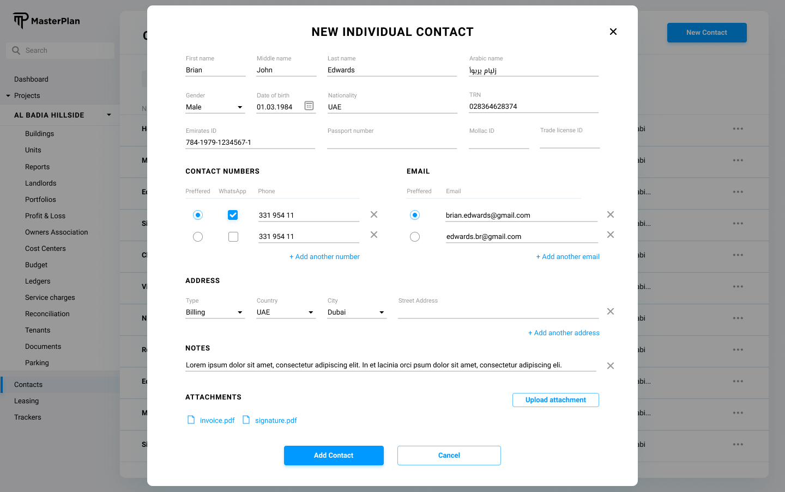

# Definition

Contact entity is used to capture all the individuals and companies those we interact in real life or use the system directly.

# Properties

Contact entity corresponds to “contact” table in the database which has the following fields:

| Property  | Type   | Reference | Reference To | Description | Method | Individual | Company
| ------    | ------ | ------    | ------       | ------      | ------ | ------     | ------
| id | Int | PK | - | Unique Identifier | Auto generated | Yes | Yes
| user| Int| FK| -| Assigned User of the Contact| User entry| Yes| Yes
| contact_type| Text| FK| Contact Type| -| Dropdown| Yes| Yes
| name| Text| -| -| Name of the Contact| User entry| Yes| Yes
| middle_name| Text| -| -| Middle name of the Contact| User entry| Yes| No
| surname| Text| -| -| Surname of the Contact| User entry| Yes| No
| arabic_name| Text| -| -| Full name of the contact with Arabic letters| User entry| Yes| Yes
| gender| M/F/N| -| -| Limited to Male, Female, Not Disclosed| Dropdown| Yes| No
| TRN| Text| -| -| Tax Registration Number| User entry| Yes| Yes
| dob| Date| -| -| Date of Birth| Date Picker| Yes| No
| sub_contact_of| Int| FK| Contact| An individual can be bound to a company| Searchable dropdown| Yes| No
| signature| Text| -| -| Our agents have signatures which are used in the property portal ads.| User entry| Yes| No
| emirates_id| Text| -| -| -| User entry| Yes| No
| passport_number| Text| -| -| -| User entry| Yes| No
| trade_license_id| Text| -| -| -| User entry| No| Yes
| mollak_id| Text| -| -| -| User entry| Yes| Yes
| emails| JSON| -| -| Refer to below description| User entry| Yes| Yes
| phones| JSON| -| -| Refer to below description| User entry| Yes| Yes
| addresses| JSON| -| -| Refer to below description| Google Maps| Yes| Yes
| is_active| Bool| -| -| -| Checkbox| No| Yes
| is_approved| Bool| -| -| -| Checkbox| No| Yes
| registered_on| Date| -| -| -| Date Picker| No| Yes
| expiry_on| Date| -| -| -| Date Picker| No| Yes

Emails JSON Definition: 

```
[
    {
        email: Text, 
        isDefault: Boolean
    }, 
    ...
]
```

Phones JSON Definition:

```
[
    {
        number: Text, 
        isDefault: Boolean, 
        isWhatsapp: Boolean
    }, 
    ...
]
```

Addresses JSON Definition:

```
[
    {
        address: Text, 
        isBilling: Boolean, 
        isDelivery: Boolean
    }, 
    ...
]
```

# Processes

## List


Contacts are listed in a tabular format with the following fields:
* Name: Name of the contact. Click action takes the system to the “Editing Contacts”.
* Type: Type of the contact listed under “Contact Types”. Click action takes the system to the “Editing Contacts”.
* Email Address: Displays the default email address of the contact. If there are multiple addresses assigned for the contact, an ellipsis icon is shown. Hover action over ellipsis opens a tooltip listing the additional email addresses. Click action takes the system to the “Editing Contacts”.
* Phone Number: Displays the default phone number of the contact. If there are multiple phone numbers assigned for the contact, an ellipsis icon is shown. Hover action over ellipsis opens a tooltip listing the additional phone numbers. Click action takes the system to the “Editing Contacts”.
* Primary Address: Displays the default address of the contact. If there are multiple addresses assigned for the contact, an ellipsis icon is shown. Hover action over ellipsis opens a tooltip listing the additional addresses. Click action takes the system to the “Editing Contacts”.

Search field allows searching amongst name column of the table.

(Phase 2) Search field should also be capable of searching using the references of the contacts.

New Contact button placed on the top right corner of the listing UI opens a modal UI to define a new contact described in the “Creating Contact” section of this document.

## View/Edit

To create a new contact in the system, in the Listing Contacts UI, "New Contact" button should be clicked and the type of the contact should be chosen as can be seen at the below screenshot:


Company type contacts are created in the system using a modal screen as shown below:


Individual type contacts are created in the system using a modal screen as shown below:



As can be seen from the design, Address, Phone, Email Address fields can contain multiple entries.

Cancel button cancels the process and returns to the contact listing.

Esc button on the user's keyboard has the same effect as the Cancel button.

Once the content is populated “Save” button saves the contact to the system database.

Notes about the contact can be multiple and will be handled in the way that is described in the Note section of this document.

A contact can have a profile picture, which can be uploaded using the method described in the Document section of this document.

A contact can have multiple documents, which can be uploaded using the method described in the Document section of this document.

Email signature of a contact is a plain text field entered by the user.

A wet signature can be 
- [ ] Uploaded to web interface of the system 
- [ ] Directly signed on the mobile interface of the system

For the vendor company type contacts:

* Vendor Registration Number is used as an integration unique identifier with integration to the “Payfort” payment gateway platform.
* Invoice generation is being done through Payfort, an online payment gateway, and Vendor Registration Number is being created manually as a Merchant Reference Number or Invoice Number. 
* Vendor Registration Number will be auto-generated once the status has been changed to “Active”.

When a contact has type of “Vendor Company” system will enable the service assignment section of the “Contact” details screen. 

Creation of a contact also creates a “Ledger” in the system database. So the database should be inserting one tuple into the “contact” table and retrieving the inserted id, and insert another tuple to the “ledger” table with the “contact” field assigned as the contacts id.

## Delete

On the contact details screen which is described in the “Creating Contact” section of this document, top-right part of the UI provides a delete contact button. Click action to this button should trigger a confirmation and upon confirmation, the contact and it's ledger should be deleted from the system database. Once the deletion process is complete, the screen should return to the previous state, in which, the modal screen is opened to view the details of the contact.

## Assign

Throughout this document the contact assignment process is mentioned. Whenever a contact assignment to another entity is required a modal screen should open and a UI similar to below should be introduced to the user.


In this UI, if the cancel button is clicked, the modal closes and the process is cancelled.

If “New Contact” button is clicked, the UI defined in the “Creating Contact” section of this document should open in a modal screen. Once the contact creation is completed, the system should fall back to this screen and filter only the created contact so that the assignment of it gets easier.

If the user selects a function and clicks to Assign button on the respective row of this table, the contact is assigned as the contact of the referred entity. In this case, the system inserts a record to the “contact_reference” table of the database, with the below details:

* contact: selected contact
* function: selected function
* reference: This defines the reference point of the contact. If the contact assignment UI is called from a Unit, this should be the Unit from the “Reference” table, etc.
* referrer: id field of the referring table’s tuple.

## Service Category Assignment

When a contact has the vendor company type assigned, the system should provide a searchable dropdown with the defined service categories to be assigned.

## Create User for Contact

Contact edit screen should provide a button to create a user for the contact with the primary email address as the username and send an email notification to create a password and SMS/WhatsApp message for installing the phone application.
