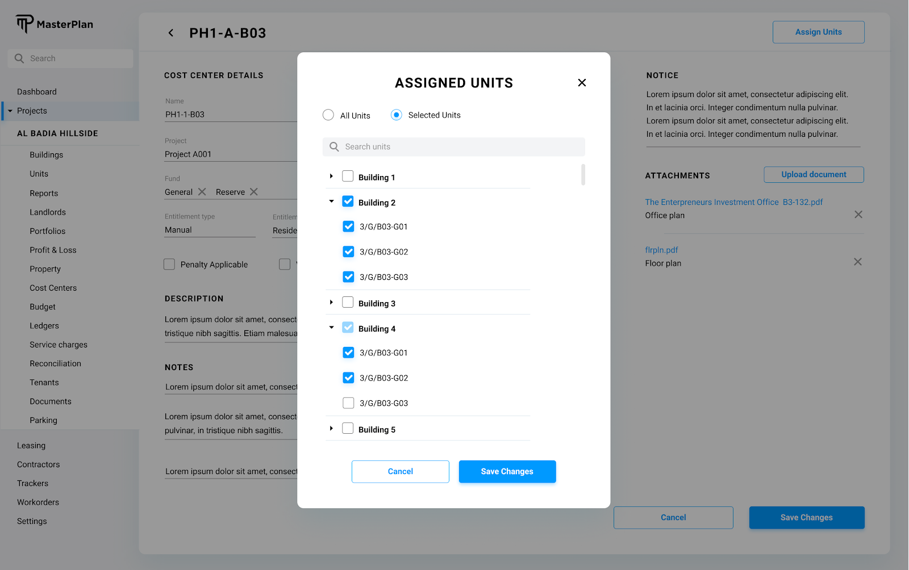

# Definition

Cost Center is a group of units within a project that is used to segmentize the budgets for the projects. 

# Properties

Cost Center entity doesn't correspond to any collection in the database, however it is a sub-object under the project entity with the following fields:

| Property  | Type   | Reference | Reference To | Description | Method
| ------    | ------ | ------    | ------       | ------      | ------
id|Int|PK|-|Unique Identifier|Auto generated
name|Text|-|-|Name of the cost center|User entry
hasGeneralFund|Bool|-|-|-|Checkbox
hasReserveFund|Bool|-|-|-|Checkbox
description|Text|-|-|-|User entry
entitlement_type|Text|FK|Entitlement Type|Entitlement Type|Dropdown
entitlement_type_reason|Text|-|-|-|User entry
aggregate_entitlement|Calc|-|-|-|-
notice_text|Text|-|-|-|User entry
isPenaltyApplicable|Bool|-|-|-|Checkbox
isVATFreeSCAllocation|Bool|-|-|-|Checkbox
date|Date|-|-|-|Date Picker
mollak_id|Text|-|-|-|User entry
mollak_name|Text|-|-|-|User entry
mollak_sc_usage|Text|-|-|-|User entry
units|JSON Object|-|-|-|Assign Unit Process

# Processes

## List

System should list the cost centers under the currently active project in a tabular format as represented below:


Click action on any of the columns should open a modal UI and display the cost center details as described at the Editing a Cost Center / Cost Center Details section of this document.

Click action on “Create” button initiates Creating a Cost Center process.

## Create


When “Create” button is clicked on the “Listing Cost Centers” screen, a modal dialog opens and asks only for the “Name” of the new cost center. 

Two buttons on the modal screen should exist. 
* Create: Creates the cost center. Following the creation, system takes the user interface to the newly created cost center details screen as explained below.
* Cancel: Cancels the creation and rolls back to cost center listing.

## Edit/View




Name: Name of the cost center.

Project: The project of the cost center.

Has General Fund: Checkbox.

Has Reserve Fund: Checkbox.

Entitlement Type: Dropdown list of the “Entitlement Type” entity.

Entitlement Reason: Text user entry.

Aggregate Entitlement: Dynamically calculated as a sum of square footage of all the descendant units.

Penalty Applicable: Checkbox.

VAT Free SC Allocation: Checkbox.

Date: Date Picker.

Mollak ID: The identifier used to integrate with the Mollak system.

Mollak Name: Textual name of the cost center in the Mollak system.

Mollak SC Usage: Textual user entry.

Notice Text: Edited using a rich text box editor via a modal screen interface.

Description: Edited using a rich text box editor via a modal screen interface.

Attachments will be listed using Listing Documents process, and can be added for a Cost Center  using Uploading Documents process.

Notes will be listed using Listing Notes process, and can be added for a Cost Center  using Creating Note process.

## Assign Units

Click action of the “Assign Units” button on the cost center detail screen should open a new modal UI and represent the list of unassigned units. From this list user should be able to assign the available units to the cost center.

The list of units are only the units which are listed under the project "units" array.  
When the unit is assigned to a cost center it turns to true in the units object.

Sample object for the units field is provided below

```
{
    unit_1: true,
    unit_2: false,
    ...,
    unit_n: true
}
```

With this, the assignment logic will be very simple to implement on the UI.