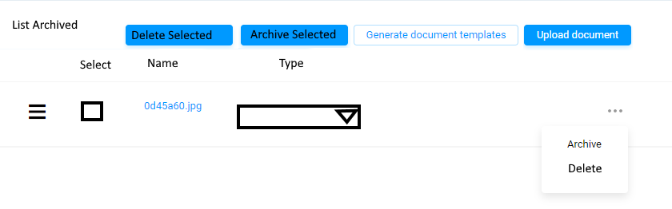
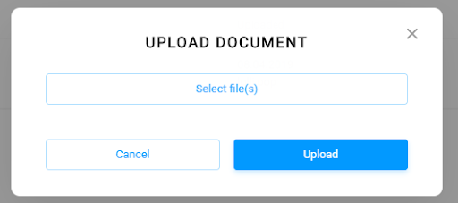

# Definition

Throughout the system, there are many points a user can upload a document as an attachment to an entity. Document entity is created in order to accommodate this need in the system. Document entity tuples are all recorded under the relevant parts of the database as a JSON array in the relevant object in Firestore.

# Properties

Each document entry will be having the below json fields:

| Property  | Type   | Reference | Reference To | Description | Method
| ------    | ------ | ------    | ------       | ------      | ------
id|Int|PK|-|Unique Identifier|Auto generated
name|Text|-|-|Name of the document|User entry
type|Text|FK|Document Type|-|Read-only
created_at|Timestamp|-||-|Read-only
archived_at|Timestamp|-|-|Defines the archival date-time of the document and any non-null value indicates archived document.|Read-only
url|Text|-|-|Auto generated by the system|Auto generated
content_type|Text|-|-|MIME Content Type of the file|Read-only
position|Int|-|-|Refer to the below description|Drag&Drop
start_date|Date|-|-|Refer to the document type section|Date picker
end_date|Date|-|-|Refer to the document type section|Date picker
issue_date|Date|-|-|Refer to the document type section|Date picker
expiry_date|Date|-|-|Refer to the document type section|Date picker
notification_date|Date|-|-|Refer to the document type section|Auto generated

# Processes

## List

Documents are always listed as a sub component of another entity as shown below.

Documents are listed in a tabular format in the system. 

Above the listing, there can be several buttons:

* Delete Selected: If there are selected items using the selection checkboxes in the list, this button gets activated. If there is no selection, button will be disabled. Delete process is described in the following sections.

* Archive Selected: If there are selected items using the selection checkboxes in the list, this button gets activated. If there is no selection, button will be disabled. Archive process is described in the following sections.

* Generate Document Templates: If the document listing component is called from a section of the system which has some predefined document templates, this button opens a modal screen and offers to download one or more of the predefined document templates. Predefined documents templates are identified in this document within the corresponding sections.

* Upload Document: This button activates the upload document process described in the following section.

The fields of the listing table is listed as below:

* (Phase 2) Drag & Drop Handle: Using this handle user can reorder the documents. Reordering result changes the position field in the tuples of the document table.

* (Phase 2) Selection Checkbox: List items can be selected using these checkboxes for the bulk actions.
* (Phase 2) Thumbnail: If a document content type is identified as an image, a thumbnail of the image should be displayed. Any other content type should be listed with a corresponding icon.

* Name: User readable name of the file. This field should be a text field which is in place editable. 
* Type: Type of the file as defined in the Document Type section. This field should be a dropdown and user should be able to update the document type in place. While updating the document type, the dropdown UI should be able to filter the type list according to the list’s display. Such as, if a document list is being displayed in a Unit detail section of the system, only the Unit related types should be listed in the dropdown. The relative document type lists are listed in the corresponding sections of this document. Such as, Unit related document types are mentioned in the Unit section of this document, etc.

* Ellipsis button menu: This menu should provide the functionality of

    * Archive: Archiving the document (with a confirmation).
    * Delete: Deleting the document (with a confirmation).

All the document displays occur in the corresponding Entity sections of the system. Such as, all the documents related to a unit are listed under the Unit Detail user interface.

All the document displays are ordered using the position field referred to in the database table. 

Document list should be searchable via document name.

Document list type field should give the ability to filter according to the document types.

## Upload

Documents are uploaded to the system using a modal screen as shown below:

Cancel button cancels the upload and returns to the document listing.

Esc button on the user’s keyboard cancels the upload and returns to the document listing.

Once one or more files are selected, “Upload” button uploads the documents up to the system and stores them.

Each file uploaded creates a record in the “document” table of the system database.

* name field should be assigned with the name of the uploaded file.
* reference field should be assigned to the corresponding Reference. Such as, if the document is uploaded from the Unit user interface, Reference should mention the corresponding Reference.
* referrer field should be assigned to the corresponding entity’s unique identifier from the corresponding table. 
* uploaded_on field should be set as the current date/time.
* url field should be set to the documents accessible download link address.
* content_type field should be set to the content_type of the uploaded file.
* position field of the file should be set to (Maximum + 1) of the currently existing documents’ position field. 

As soon as all the files uploaded and the tuples are stored in the system database, the upload modal should close automatically. As soon as the modal screen closed, the document listing should be updated from the database and all the previously existing and the newly uploaded documents should be listed in the list.

## Archive

Archival of documents can be triggered in two ways. 
* Clicking the button on the documents’ row, ellipsis button, and clicking “Archive”.
* (Phase 2) Selecting multiple documents from the list and  clicking the button “Archive Selected”.

Upon this trigger, the system should confirm with the user and if confirmed should update the field archived_at as current timestamp for the selected tuples.

## Show Archived

In the document listing UI, if the user clicks the “List Archived” system will only list the archived documents. 

## Unarchive

When the list is showing archived documents, ellipsis button changes the subitems as the “Unarchive” and “Delete”. If the Unarchive button is clicked, the system should confirm with the user and if confirmed should update the field is Archived as false for the tuple.

## Delete

Deletion of documents can be triggered in two ways.

* Clicking the button on the documents’ row, ellipsis button, and clicking “Delete”.
* (Phase 2) Selecting multiple documents from the list and clicking the button “Delete Selected”.

Upon this trigger, the system should confirm with the user and if confirmed should delete the tuples from the database and delete the files from the storage.

