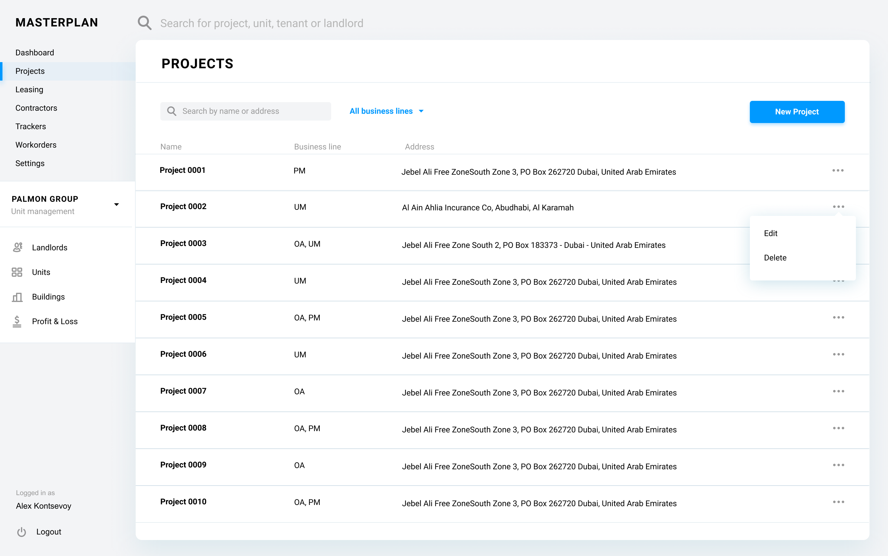
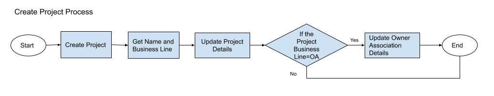
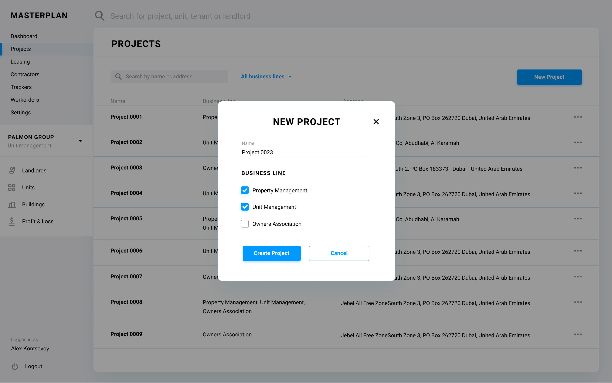
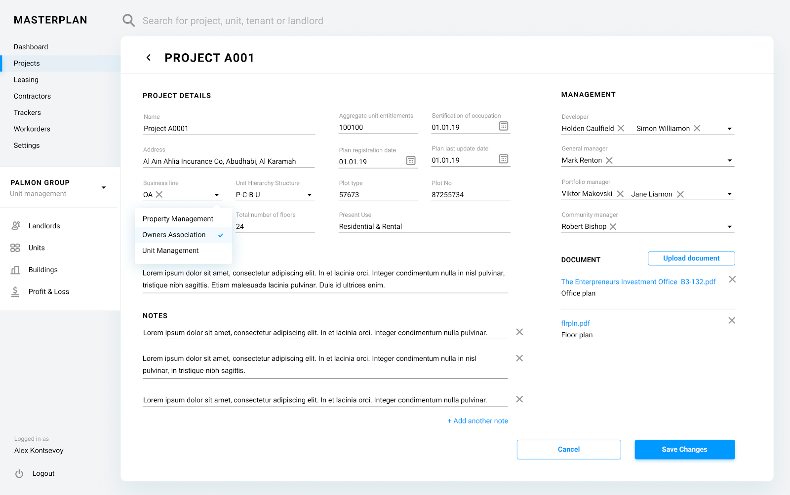
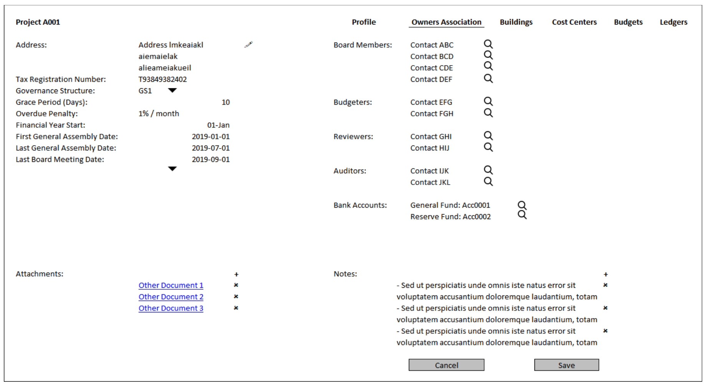

# MasterPlan

Project is designed to provide home for all the automation that is required by the Kaizen Asset Management Services (KAMS).

Please use sidebar to browse through this documentation.

# Purpose of Documentation

Purpose of this design & processes definition document can be summarized in below points:
* To be able to provide a holistic view on all the current and future entities in the KaizenAMS MasterPlan Centralized Asset Management System.
* To be able to give a detailed view on all the processes expected from the system to be accomplished. 
* To be able to provide a solid reference point for the development team of the expected final product.

# ER Diagram

The ER (Entity Relationship) diagram is provided as the main reference point for the whole system and its entities. In the following sections of this document more focused diagrams will also be provided to be ale to explain specific processes.

The ER diagram is created using draw.io which also has desktop applications for use as well as the web application.

Diagram can be found here: [ER Diagram](https://github.com/kaizenams/masterplan-web/blob/master/ERDiagram.drawio) 

# Business Lines

KAMS operates in several business lines and these are listed as below:  
* Unit Management
* Property Management
* Owners Association Management
* Value Added Services

## Unit Management
KaizenAMS unit management service is targeted at the landlords who own a portfolio of properties/assets. This line of business consists of tasks such as, leasing, managing, maintaining and organizing the service providers and suppliers of the assets in the portfolio.

A portfolio can be defined as a grouping of tangible assets such as units, buildings, projects, etc.

The main purposes of systemizing the unit management can be summarized as below:
* Provide a better service to our clients.
* Provide a better service to tenants of the units managed.
* Provide a solid system to KaizenAMS operations team to manage the units as a means to reach success in the previous two points.

## Property Management
KaizenAMS property management service aims to take the hassle away from the owner by ensuring provided services encompass all aspects of running a profitable property.

In order to reach this aim, MasterPlan system should be able to provide:
* Document Control
* Maintenance Management
* Facility Management
* Reporting

## Owners Association Management
An owners association (OA) is an organization in a community or condominium that makes and enforces rules for the properties and their residents. Those who purchase property within an OA’s jurisdiction automatically become members and are required to pay dues, known as service fees. 

An OA is a non-profit organization.

KaizenAMS OA management services include:
* Advisory on financials including budget preparation
* Financial Management
* Service Provider Management
* Administrative Management
* Consultancy

As a result of these services provided MasterPlan system should provide an automation system to assist Kaizen employees to provide best services.

## Value Added Services

### Parking Management
Kaizen AMS plans to provide a value added service for the project owners and the residents of the projects and also eventually to the larger population of the locations we provide our services. The parking management service is ideated as the providing a parking sharing facility for the residents while also providing an additional income to the project owners.
- [ ] Phase 3: Define the business logic and the necessary functionalities for the parking management business.

### Other Value Added Services
- [ ] Phase 3: Populate here @alidikici

# System Database

MasterPlan uses Firestore database as the backend database of the whole system. 

Throughout this document the collections required for all the entities and processes will be listed with the field list and field required functionalities.

It should be noted that the Firestore pricing depends on the read/write and transfers from the database such as egress and ingress. Due to this nature of the Firestore database, developers should be careful about the number of writes and reads made to the database.

Throughout the documentation, the hints will be provided for the cost cutting approaches for the Firestore databases. However, developers should be careful about the implementation and should the feedback.

# System User Interface

Home of the system UI displays a dashboard for users.
- [ ] Identify dashboard UI and requirements @alidikici

Main Menu Items:
* Projects
* Contacts
* Portfolios
* Workorders
* Users
* System Settings

- [ ] Identify additional top level menu items @alidikici

# Project

The project is the main focal point for all Business Lines

## Project Properties
Project entity corresponds to “project” table in the database which has the following fields:

| Property  | Type   | Reference | Reference To | Description | Method
| ------    | ------ | ------    | ------       | ------      | ------
id|Int|PK|-|Unique Identifier|Auto generated
name|Text|-|-|Name of the project|User entry
isPM|Bool|-|-|Is project property managed|Checkbox
isOA|Bool|-|-|Is project owners association managed|Checkbox
isUM|Bool|-|-|Is project units are unit managed|Checkbox
address|JSON|-|-|-|Google Maps UI
units|Int|-|-|Total number of units in the project|Dynamic Calculation
floors|Int|-|-|Total number of floors in the project|Dynamic Calculation
aggregate_entitlement|Float|-|-|Total entitlements as an aggregate|Dynamic Calculation
plan_registered_on|Date|-|-|-|Date Picker
certification_of_occupation_on|Date|-|-|-|Date Picker
project_plot_type|Text|FK|Plot Type|-|Dropdown
plan_no|Text|-|-|-|User entry
present_use|Text|-|-|-|Dynamically Generated
oa_address|JSON|-|-|-|Google Maps UI
trn|Text|-|-|Tax Registration Number|User entry
project_governance_structure|Text|FK|Governance Structure|-|Dropdown
grace|Int|-|-|Number of days of grace for each payment related to project service charge invoices|User entry
overdue_penalty|Int|-|-|Percentage per month of overdue penalty|User entry
fy_start|dd/mm|||Required for budget season definition|User entry
first_general_assembly_on|Date|-|-|-|Date Picker
last_general_assembly_on|Date|-|-|-|Date Picker
last_board_on|Date|-|-|-|Date Picker
mollak_id|Text|-|-|Mollak Database ID|User entry
access_management_definitions|JSON|-|-|Phase 2|Phase 2

## Project Processes

### Project Listing
All the projects in the system are recorded in the project table in the system database, irrespective of the business line.

Listing of Projects will be done in a tabular format with the following columns, represented from the corresponding fields from the database table:
* Name: Name of the project.
* Business Line: Lines of business where the project is assigned to by abbreviations.
    * PM: Project Management
    * OA: Owners Association Management
    * UM: Unit Management
* Address: Address of the main project.
There are additional action items on the Unit listing screen, listed below:
* New Project: This button opens a modal dialog described in the below “Creating a Project” section.
* Search: Search is done on the names and/or addresses of the projects.
* Filter: 
    * UM Filter: Shows only the unit managed projects.
    * PM Filter: Shows only the property managed projects
    * OA Filter: Shows only the owners association managed projects
    * Address Filter: Can filter based on the country and city

### Project Delete

A project can be deleted from the listing projects screen of the system. However, project deletion is not expected to happen normally and should require admin privileges. 

If the user has the necessary privileges, when the ellipsis button is clicked and the “Delete” option is selected from the listing projects screen, a confirmation dialog should confirm with the user and the system should run the below queries on the system database upon confirmation:
* Delete units of the project.
* Delete cost centers of the project.
* Delete buildings of the project.
* Delete the project tuple.

If the user doesn’t have the necessary privileges, system should show a warning message informing the user.

### Project Create

When “Create” button is clicked on the “Listing Projects” screen, a modal dialog opens and asks only for the “Name”, isPM, isOA and isUM fields. 

Two buttons on the modal screen should exist. 
* Create: Creates the project. Following the creation takes the user interface to the newly created project details screen explained below.
* Cancel: Cancels the creation and rolls back to projects listing.

Project creation on the backend database should be completed as a transaction with the below steps:
* Insert tuple into the project table
* Insert tuple into the ledger table with the type "Project Ledger" and project as the last inserted id from the previous step.
* Insert tuple into the ledger table with the type "OA Ledger" and project as the last inserted id from the previous step.

### Project Edit/View

Project details user interface employs a tabbed interface. Each tab and functionality is described in the following subsections.

#### Profile Tab

Name: Name of the project.

Address: Address of the project. Edit button next to address opens the Address selection/creation UI on a modal screen.

Business Line: Dropdown menu identifies if the project’s business line (PM, OA, and UM).

Total Number of Units: This is the dynamically calculated number of units as an aggregation from the buildings & cost centers.

Total Number of Floors: This is the dynamically calculated number of floors as an aggregation from the buildings & cost centers.

Aggregate Unit Entitlements: This is the dynamically calculated total of the unit entitlements from the buildings & cost centers.

Plan Registration Date: Date picker

Plan Last Update Date: Date picker

Certification of Occupation Date: Date picker

Plot Type: * [ ] @ariza

Plan No: User entry

Present Use: This is the dynamically curated information of the units as an aggregation from the buildings & cost centers. Lists all the distinct unit types under the given project.

Warning Message: Edited using a rich text box editor via a modal screen interface.

Developer: Developer is assigned to the unit using “Assigning Contact” process.

General Manager: General manager is assigned to the unit using “Assigning Contact” process.

Portfolio Manager: [ ] Does a project has a portfolio manager> Portfolio manager is assigned to the unit using “Assigning Contact” process.

Community Manager: Community manager is assigned to the unit using “Assigning Contact” process.

Marketing Description: Marketing Description to be used with the “Insert Community Description” button at the unit marketing tab and will be edited using a rich text editor UI component.

Attachments will be listed using Listing Documents process, and can be added for a project using Uploading Documents process.

Notes will be listed using Listing Notes process, and can be added for a project using Creating Note process.

#### Owners Association Tab

If the project is OA managed as defined in the project’s profile page, the project details should show this tab.

Address: Address of the owners association. Edit button next to address opens the Address selection/creation UI on a modal screen.

Tax Registration Number: Corresponds to the trn field in the project table of the system database.

Grace Period: Corresponds to the grace field in the project table of the system database and defines the default grace period for the budgets created for the project.

Overdue Penalty:  Corresponds to the overdue_penalty field in the project table of the system database and defines the default overdue penalty for the budgets created for the project.

Financial Year Start: dd-mm as a part of date. Will be used in the definition of the budget for the owners association budget of the project. Corresponds to the fystart field in the project table of the system database.

First General Assembly Date: Will be entered using a date picker UI. Corresponds to the first_general_assembly_on field in the project table of the system database.

Last General Assembly Date: Will be entered using a date picker UI. Corresponds to the last_general_assembly_on field in the project table of the system database.

Last Board Meeting Date: Will be entered using a date picker UI. Corresponds to the last_board_on field in the project table of the system database.

Board Members: Each board member is assigned to the unit using “Assigning Contact” process.

Attachments will be listed using Listing Documents process, and can be added for a project using Uploading Documents process.

Notes will be listed using Listing Notes process, and can be added for a project using Creating Note process.

#### Buildings Tab
Behavior of this tab is defined at Listing Buildings process definition.

#### Cost Centers Tab
Behavior of this tab is defined at Listing Cost Centers process definition.

#### Units Tab
Behavior of this tab is defined at Listing Units process definition.

#### Budgets Tab
Behavior of this tab is defined at Listing Budgets process definition.

#### Access Management Tab
* [ ] Should be defined @ariza

#### Ledgers Tab
Each project has two ledgers created automatically while it's creation as mentioned above in this documentation section.  
Behavior of this tab is defined at Ledger section of this documentation.
- [ ] @alidikici add link to Ledger

<!-- # Table of Contents

[Scenarios](Scenarios)  
[Scheduled Tasks](Scheduled Tasks)  
[Communication Templates](Communication Templates)  

[Unit](./content/Unit)  
[Unit Type](./content/Unit Type)  
[Unit Sub-Type](./content/UnitSubType.md)  
[Recency](./content/Recency.md)  
[Landlord](./content/Landlord.md)  
[Tenancy](./content/Tenancy.md)  
[Tenancy Status](./content/TenancyStatus.md)  
[Building](./content/Building.md)  
[Cost Center](./content/CostCenter.md)  
[Budget](./content/Budget)  
[Budget Status](./content/BudgetStatus.md)  
[Budget Type](./content/BudgetType.md)  
[Budget Driver](./content/BudgetDriver.md)  
[Budget Item](./content/Budget Item)  
[Portfolio](./content/Portfolio)  
[Ledger](./content/Ledger)  
[Ledger Type](./content/Ledger Type)  
[Journal Entry](./content/JournalEntry.md)  
[Invoice](./content/Invoice.md)  
[Account](./content/Account.md)  
[Department](./content/Department.md)  
[Complaint](./content/Complaint.md)  
[Workorder](./content/Workorder.md)  
[Governance Structure](./content/GovernanceStructure.md)  
[Bank Account](./content/BankAccount.md)  
[Bank Account Type](./content/BankAccountType.md)  
[Document](./content/Document.md)  
[Document Type](./content/DocumentType.md)  
[Reference](./content/Reference.md)  
[Note](./content/Note.md)  
[NoteType](./content/NoteType.md)  
[Contact](./content/Contact)  
[Contact Type](./content/Contact Type)  
[Contact Reference](./content/ContactReference.md)  
[Contact Function](./content/ContactFunction.md)  
[Service Category](./content/ServiceCategory.md)  
[User](./content/User.md)  
[Persona](./content/Persona.md)  
[Type Definition User Interface](./content/TypeDefUI.md)  
[Settings](./content/Settings.md)  
[Integrations](./content/Integrations.md)  

 -->