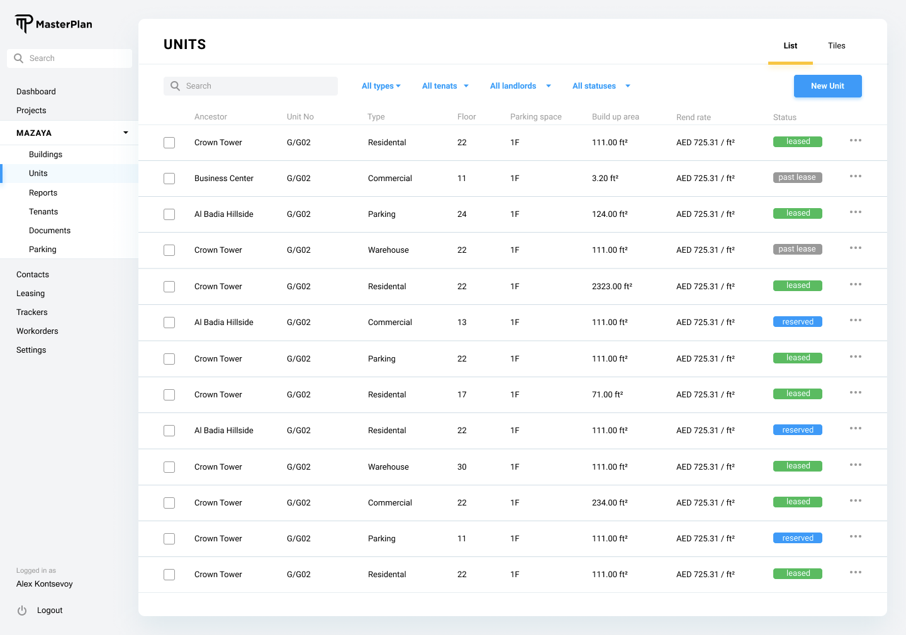
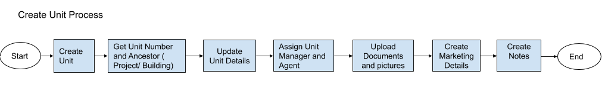

# MasterPlan

Project is designed to provide home for all the automation that is required by the Kaizen Asset Management Services (KAMS).

Please use sidebar to browse through this documentation.

# ER Diagram

The ER (Entity Relationship) diagram is provided as the main reference point for the whole system and its entities. In the following sections of this document more focused diagrams will also be provided to be ale to explain specific processes.

The ER diagram is created using draw.io which also has desktop applications for use as well as the web application.

Diagram can be found here: [ER Diagram](https://github.com/kaizenams/masterplan-web/blob/master/ERDiagram.drawio) 

# Business Lines

KAMS operates in several business lines and these are listed as below:  
* Unit Management
* Property Management
* Owners Association Management
* Value Added Services

## Unit Management
KaizenAMS unit management service is targeted at the landlords who own a portfolio of properties/assets. This line of business consists of tasks such as, leasing, managing, maintaining and organizing the service providers and suppliers of the assets in the portfolio.

A portfolio can be defined as a grouping of tangible assets such as units, buildings, projects, etc.

The main purposes of systemizing the unit management can be summarized as below:
* Provide a better service to our clients.
* Provide a better service to tenants of the units managed.
* Provide a solid system to KaizenAMS operations team to manage the units as a means to reach success in the previous two points.

## Property Management
KaizenAMS property management service aims to take the hassle away from the owner by ensuring provided services encompass all aspects of running a profitable property.

In order to reach this aim, MasterPlan system should be able to provide:
* Document Control
* Maintenance Management
* Facility Management
* Reporting

## Owners Association Management
An owners association (OA) is an organization in a community or condominium that makes and enforces rules for the properties and their residents. Those who purchase property within an OA’s jurisdiction automatically become members and are required to pay dues, known as service fees. 

An OA is a non-profit organization.

KaizenAMS OA management services include:
* Advisory on financials including budget preparation
* Financial Management
* Service Provider Management
* Administrative Management
* Consultancy

As a result of these services provided MasterPlan system should provide an automation system to assist Kaizen employees to provide best services.

## Value Added Services

### Parking Management
Kaizen AMS plans to provide a value added service for the project owners and the residents of the projects and also eventually to the larger population of the locations we provide our services. The parking management service is ideated as the providing a parking sharing facility for the residents while also providing an additional income to the project owners.
- [ ] Phase 3: Define the business logic and the necessary functionalities for the parking management business.

### Other Value Added Services
- [ ] Phase 3: Populate here @alidikici

# System Database

MasterPlan uses Firestore database as the backend database of the whole system. 

Throughout this document the collections required for all the entities and processes will be listed with the field list and field required functionalities.

It should be noted that the Firestore pricing depends on the read/write and transfers from the database such as egress and ingress. Due to this nature of the Firestore database, developers should be careful about the number of writes and reads made to the database.

Throughout the documentation, the hints will be provided for the cost cutting approaches for the Firestore databases. However, developers should be careful about the implementation and should the feedback.

# System User Interface

Home of the system UI displays a dashboard for users.
- [ ] Identify dashboard UI and requirements @alidikici

Main Menu Items:
* Projects
* Contacts
* Portfolios
* Workorders
* Users
* System Settings

- [ ] Identify additional top level menu items @alidikici

# Project

The project is the main focal point for all Business Lines

## Project Properties
Project entity corresponds to “project” table in the database which has the following fields:

| Property  | Type   | Reference | Reference To | Description | Method
| ------    | ------ | ------    | ------       | ------      | ------
id|Int|PK|-|Unique Identifier|Auto generated
name|Text|-|-|Name of the project|User entry
isPM|Bool|-|-|Is project property managed|Checkbox
isOA|Bool|-|-|Is project owners association managed|Checkbox
isUM|Bool|-|-|Is project units are unit managed|Checkbox
address|JSON|-|-|-|Google Maps UI
units|Int|-|-|Total number of units in the project|Dynamic Calculation
floors|Int|-|-|Total number of floors in the project|Dynamic Calculation
aggregate_entitlement|Float|-|-|Total entitlements as an aggregate|Dynamic Calculation
plan_registered_on|Date|-|-|-|Date Picker
certification_of_occupation_on|Date|-|-|-|Date Picker
project_plot_type|Text|FK|Plot Type|-|Dropdown
plan_no|Text|-|-|-|User entry
present_use|Text|-|-|-|Dynamically Generated
oa_address|JSON|-|-|-|Google Maps UI
trn|Text|-|-|Tax Registration Number|User entry
project_governance_structure|Text|FK|Governance Structure|-|Dropdown
grace|Int|-|-|Number of days of grace for each payment related to project service charge invoices|User entry
overdue_penalty|Int|-|-|Percentage per month of overdue penalty|User entry
fy_start|dd/mm|||Required for budget season definition|User entry
first_general_assembly_on|Date|-|-|-|Date Picker
last_general_assembly_on|Date|-|-|-|Date Picker
last_board_on|Date|-|-|-|Date Picker
mollak_id|Text|-|-|Mollak Database ID|User entry
access_management_definitions|JSON|-|-|Phase 2|Phase 2

## Project Processes

### Project Listing
All the projects in the system are recorded in the project table in the system database, irrespective of the business line.

Listing of Projects will be done in a tabular format with the following columns, represented from the corresponding fields from the database table:
* Name: Name of the project.
* Business Line: Lines of business where the project is assigned to by abbreviations.
    * PM: Project Management
    * OA: Owners Association Management
    * UM: Unit Management
* Address: Address of the main project.
There are additional action items on the Unit listing screen, listed below:
* New Project: This button opens a modal dialog described in the below “Creating a Project” section.
* Search: Search is done on the names and/or addresses of the projects.
* Filter: 
    * UM Filter: Shows only the unit managed projects.
    * PM Filter: Shows only the property managed projects
    * OA Filter: Shows only the owners association managed projects
    * Address Filter: Can filter based on the country and city

### Project Delete

A project can be deleted from the listing projects screen of the system. However, project deletion is not expected to happen normally and should require admin privileges. 

If the user has the necessary privileges, when the ellipsis button is clicked and the “Delete” option is selected from the listing projects screen, a confirmation dialog should confirm with the user and the system should run the below queries on the system database upon confirmation:
* Delete units of the project.
* Delete cost centers of the project.
* Delete buildings of the project.
* Delete the project tuple.

If the user doesn’t have the necessary privileges, system should show a warning message informing the user.

### Project Create

When “Create” button is clicked on the “Listing Projects” screen, a modal dialog opens and asks only for the “Name”, isPM, isOA and isUM fields. 

Two buttons on the modal screen should exist. 
* Create: Creates the project. Following the creation takes the user interface to the newly created project details screen explained below.
* Cancel: Cancels the creation and rolls back to projects listing.

Project creation on the backend database should be completed as a transaction with the below steps:
* Insert tuple into the project table
* Insert tuple into the ledger table with the type "Project Ledger" and project as the last inserted id from the previous step.
* Insert tuple into the ledger table with the type "OA Ledger" and project as the last inserted id from the previous step.

### Project Edit/View

Project details user interface employs a tabbed interface. Each tab and functionality is described in the following subsections.

#### Project Profile Tab

Name: Name of the project.

Address: Address of the project. Edit button next to address opens the Address selection/creation UI on a modal screen.

Business Line: Dropdown menu identifies if the project’s business line (PM, OA, and UM).

Total Number of Units: This is the dynamically calculated number of units as an aggregation from the buildings & cost centers.

Total Number of Floors: This is the dynamically calculated number of floors as an aggregation from the buildings & cost centers.

Aggregate Unit Entitlements: This is the dynamically calculated total of the unit entitlements from the buildings & cost centers.

Plan Registration Date: Date picker

Plan Last Update Date: Date picker

Certification of Occupation Date: Date picker

Plot Type: * [ ] @ariza

Plan No: User entry

Present Use: This is the dynamically curated information of the units as an aggregation from the buildings & cost centers. Lists all the distinct unit types under the given project.

Warning Message: Edited using a rich text box editor via a modal screen interface.

Developer: Developer is assigned to the unit using “Assigning Contact” process.

General Manager: General manager is assigned to the unit using “Assigning Contact” process.

Portfolio Manager: [ ] Does a project has a portfolio manager> Portfolio manager is assigned to the unit using “Assigning Contact” process.

Community Manager: Community manager is assigned to the unit using “Assigning Contact” process.

Marketing Description: Marketing Description to be used with the “Insert Community Description” button at the unit marketing tab and will be edited using a rich text editor UI component.

Attachments will be listed using Listing Documents process, and can be added for a project using Uploading Documents process.

Notes will be listed using Listing Notes process, and can be added for a project using Creating Note process.

#### Project Owners Association Tab

If the project is OA managed as defined in the project’s profile page, the project details should show this tab.

Address: Address of the owners association. Edit button next to address opens the Address selection/creation UI on a modal screen.

Tax Registration Number: Corresponds to the trn field in the project table of the system database.

Grace Period: Corresponds to the grace field in the project table of the system database and defines the default grace period for the budgets created for the project.

Overdue Penalty:  Corresponds to the overdue_penalty field in the project table of the system database and defines the default overdue penalty for the budgets created for the project.

Financial Year Start: dd-mm as a part of date. Will be used in the definition of the budget for the owners association budget of the project. Corresponds to the fystart field in the project table of the system database.

First General Assembly Date: Will be entered using a date picker UI. Corresponds to the first_general_assembly_on field in the project table of the system database.

Last General Assembly Date: Will be entered using a date picker UI. Corresponds to the last_general_assembly_on field in the project table of the system database.

Last Board Meeting Date: Will be entered using a date picker UI. Corresponds to the last_board_on field in the project table of the system database.

Board Members: Each board member is assigned to the unit using “Assigning Contact” process.

Attachments will be listed using Listing Documents process, and can be added for a project using Uploading Documents process.

Notes will be listed using Listing Notes process, and can be added for a project using Creating Note process.

#### Project Buildings Tab
Behavior of this tab is defined at Listing Buildings process definition.

#### Project Cost Centers Tab
Behavior of this tab is defined at Listing Cost Centers process definition.

#### Project Units Tab
Behavior of this tab is defined at Listing Units process definition.

#### Project Budgets Tab
Behavior of this tab is defined at Listing Budgets process definition.

#### Project Access Management Tab
* [ ] Should be defined @ariza

#### Project Ledgers Tab
Each project has two ledgers created automatically while it's creation as mentioned above in this documentation section.  
Behavior of this tab is defined at Ledger section of this documentation.
- [ ] @alidikici add link to Ledger

# Cost Center

## Cost Center Properties

Cost Center entity corresponds to “cost_center” table in the database which has the following fields:

| Property  | Type   | Reference | Reference To | Description | Method
| ------    | ------ | ------    | ------       | ------      | ------
id|Int|PK|-|Unique Identifier|Auto generated
name|Text|-|-|Name of the cost center|User entry
cost_center_project|Int|FK|project|Project of the cost center|Searchable Dropdown
hasGeneralFund|Bool|-|-|-|Checkbox
hasReserveFund|Bool|-|-|-|Checkbox
description|Text|-|-|-|User entry
cost_center_entitlement_type|Text|FK|Entitlement Type|Entitlement Type|Dropdown
entitlement_type_reason|Text|-|-|-|User entry
aggregate_entitlement|Calc|-|-|-|-
notice_text|Text|-|-|-|User entry
isPenaltyApplicable|Bool|-|-|-|Checkbox
isVATFreeSCAllocation|Bool|-|-|-|Checkbox
date|Date|-|-|-|Date Picker
mollak_id|Text|-|-|-|User entry
mollak_name|Text|-|-|-|User entry
mollak_sc_usage|Text|-|-|-|User entry

## Cost Center Processes

### Cost Center Listing

System should list the cost centers under the currently active project in a tabular format as represented below:

Click action on any of the columns should open a modal UI and display the cost center details as described at the Editing a Cost Center / Cost Center Details section of this document.

Click action on “Create” button initiates Creating a Cost Center process.

### Cost Center Create

When “Create” button is clicked on the “Listing Cost Centers” screen, a modal dialog opens and asks only for the “Name” of the new cost center. 

Two buttons on the modal screen should exist. 
* Create: Creates the cost center. Following the creation, system takes the user interface to the newly created cost center details screen as explained below.
* Cancel: Cancels the creation and rolls back to cost center listing.

### Cost Center Edit/View

Name: Name of the cost center.

Project: The project of the cost center.

Has General Fund: Checkbox.

Has Reserve Fund: Checkbox.

Entitlement Type: Dropdown list of the “Entitlement Type” entity.

Entitlement Reason: Text user entry.

Aggregate Entitlement: Dynamically calculated as a sum of square footage of all the descendant units.

Penalty Applicable: Checkbox.

VAT Free SC Allocation: Checkbox.

Date: Date Picker.

Mollak ID: The identifier used to integrate with the Mollak system.

Mollak Name: Textual name of the cost center in the Mollak system.

Mollak SC Usage: Textual user entry.

Notice Text: Edited using a rich text box editor via a modal screen interface.

Description: Edited using a rich text box editor via a modal screen interface.

Attachments will be listed using Listing Documents process, and can be added for a Cost Center  using Uploading Documents process.

Notes will be listed using Listing Notes process, and can be added for a Cost Center  using Creating Note process.

Assign Units: Click action of the “Assign Units” button on the cost center detail screen should open a new modal UI and represent the list of unassigned units. From this list user should be able to assign the available units to the cost center.

# Unit

Unit is the primary building block of all the business lines KaizenAMS operates in. 

## Unit Properties
All the units in the system are recorded in the units table in the system database, irrespective of the business line. 

Unit entity corresponds to “unit” table in the database which has the following fields:

| Property  | Type   | Reference | Reference To | Description | Method
| ------    | ------ | ------    | ------       | ------      | ------
id|Int|PK|-|Unique Identifier|Auto generated
name|Text|-|-|Name/Number of the Unit|User entry
unit_type|Text|FK|Unit Type|Refer to below list of types|Referred dropdown
unit_subtype|Text|FK|Unit Subtype|Refer to below list of types|Referred dropdown
unit_building|Int|FK|Building|Building the unit belongs to|Searchable dropdown
unit_cost_center|Int|FK|Cost Center|Cost Center the unit is assigned to|Searchable dropdown
unit_portfolio|Int|FK|Portfolio|Portfolio the unit belongs to|Searchable dropdown
plot|Text|-|-|Name of the plot from title deed|User entry
area|Float|-|-|Build up Area of the Unit|User entry
floor|Int|-|-|In which floor the Unit in the building|User entry
parkings|Calc|-|-|Number of parking spaces|Automatically calculated
bedrooms|Int|-|-|Number of bedrooms|User entry
bathrooms|Int|-|-|Number of bathrooms|User entry
parking_of|Int|FK|Unit|If unit type is parking, this parking unit might be bound to another unit|Searchable dropdown
is_managed|Bool|-|-|Identifies if the unit is managed by Unit Management|Checkbox
dewa_id|Text|-|-||User entry
created_on|Date|-|-|Creation date of the tuple|Auto generated
last_update|Date|-|-|Any update action should trigger the update|Auto generated
unit_tenancy_status|Text|FK|Tenancy Status|Tenancy Status of the unit|Dropdown
mollak_id|Text|-|-||User entry
access_management_definitions|JSON|-|-|Phase 2|Phase 2

## Unit Ancestors Analysis

In different business lines, a unit is accounted under different hierarchies.

Unit Management Business Line: A unit is assigned to a building and also to a portfolio. As a result, only “building” and “portfolio” fields should be populated in the database tuple.

Property Management Business Line: A unit is assigned to a building. As a result, only “building” field should be populated in the database tuple.

Owners Association Management Business Line: A unit is assigned to a building and also to a cost center. As a result, only “building” and “cost_center” fields should be populated in the database tuple.

If a unit belongs to more than one business line, in this case, the unit assignments will be done on a union basis.

## Unit Processes

### Unit Assignment

A unit can be assigned to a portfolio, cost center or other entities using this process. 
The user interface is defined as above.

### Unit Listing

Unit listing will be done in a tabular format with the following columns, represented from the corresponding fields from the "unit" table in the system database:

* Unit No: Text field. Click action on an item on this column takes the system to the details of the unit.
* Type: Display only. 
* Floor: Display only.
* Building: Click action on an item on this column takes the system to the building’s profile page with the corresponding screen.
* Cost Center: Click action on an item on this column takes the system to the cost center’s profile page with the corresponding screen.
* Portfolio: Click action on an item on this column takes the system to the portfolio’s profile page with the corresponding screen.
* Actions: This column displays an ellipsis button for further actions. 
    * Archive Unit: Requires confirmation modal dialog.

There are additional action items on the Unit listing screen, listed below:
* Create: This button opens a modal dialog described in the below “Creating a Unit” section.
* Import: This button opens a modal dialog described in the below “Importing Units” section.
* Filter: 
    * Each filter opens a searchable drop down for user to be able to filter the units according to the selection.

* [ ]  Phase 2: Implement Group By functionality

### Unit Create

When “Create” button is clicked on the “Listing Units” screen, a modal dialog opens and asks only for the “Unit No” and the direct ancestor (Building/Project/Cost Center, etc). 

Two buttons on the modal screen should exist. 

Create: Creates the unit. Following the creation takes the user interface to the newly created unit details screen explained below.

Cancel: Cancels the creation and rolls back to unit listing.

### Unit Tenancy Status Automatic Update

Phase 1: Tenancy Status will be updated by Kaizen AMS team members.

Phase 2:  
* [ ] The tenancy status of a unit should be automatically updated by the system.

1. Unit Tenancy Status - Vacant
    * Once the End date of the Tenancy record is passed, Unit status will be changed to Vacant by the system, if there is no new Tenancy record available with next start day
    * User will have the option to update the Unit Details in the below Modal form to provide more details of the Vacant Unit
2. Tenancy Status - New
    * Behavior of the New Lease is defined at Tenancy entity definition.
    * Lease agreement will be sent to Landlord for the Approval
    * Based on the Start of the Lease, system will update the unit status to Leased and make the new lease as current
3. Tenancy Status - Upcoming
    * When the end date - 120 days approaches, system will update the status of unit to Upcoming
    * Upcoming notification to be sent to the Property Manager, Listing Agent, Landlord and Tenant
4. Tenancy Status : Renew
    * Renew Lease will be created in the same New Lease UI, Tenant details will be pre-filled with the current Tenant details.
    * Generate Lease Agreement button should be enabled for the Lease.  Lease agreement document will be generated as per the Ejari Template 
    * Lease agreement will be sent to Tenant for Sign.
    * Lease agreement will be sent to Landlord for the Approval
5. Tenancy Status - Legal
    * When we change the Tenancy status to Legal, we will have below  Modal form with 2 options: 
        * Expired
        * Returned

    * User should be able to upload below 3 supporting documents for Expired
        * Late Payment Notice
        * Notarized Legal Notice
        * Final Notice 
    * User should be able to upload below 3 supporting documents for Returned
        * Returned cheque notice
        * Notarized Legal Notice
        * Final Notice
    * Once the details are provided, Tenancy Status is changed to "Legal".
    * An additional option is available in the actions: "Resolved Legal" - will change status to "Resolved Legal".
    * Note: Legal case have 2 scenarios
        * Under Legal but the Tenant is still occupying the unit.
        * Tenant already abandoned the unit and the unit should b erecovered through the authority

### Unit Edit

Unit details user interface employs a tabbed interface. Each tab and functionality is described in the following subsections.

#### Unit Profile Tab

>  Please note the above design is picked from an older design. @ekucherenko to update

Fields editable in this tab are as follows:
* Managed Unit: Checkbox
* Cost Center: Dropdown
* Building: Dropdown
* Unit Number: Text
* Type: Dropdown
* Subtype: Dropdown
* Plot Number: Text
* Dewa Premises Number: Text
* Build up Area: Float
* Floor: Int
* Bedrooms: Int
* Bathrooms: Int
* Parking of: This field is enabled if the type of the unit is parking. Once enabled, this field will become a searchable dropdown of units, filtered by the same building.
* Parking Spaces: This field is enabled if the type of the unit is not parking. To edit, a multiselect component should be shown, filtered by the parking typed units at the same building, and further filtered by the assignment status. If a parking unit is assigned to a unit, it can’t show up on this list. If not in edit mode, list of the names (number) of the parking units are displayed.
* Rent Rate: Float per square feet
* Address: A unit’s address is bound to the building. Therefore, Unit address will be referred from the building address.
* Notes: At this section, the user interface described in the Listing Notes section of this document will be used.
* Unit Manager: Unit manager is assigned to the unit using “Assigning Contact” process.
* Agent: Unit agent is assigned to the unit using “Assigning Contact” process.
* Last Updated: Any data change in the unit details triggers un update query on this field of the unit tuple.
* Mollak ID: Mollak data integration identifier with text type and user entry.
* Managed: Checkbox to define if the unit is managed by our Unit Management Business Line.
* Management Fee: Amount in UAE Dirhams per year for the management services.
* Management Start Date: Date of the management contract start.
* Management End Date: Date of the management contract end.

#### Unit Documents Tab
Documents referred to in this tab are recorded under the documents table of the database of the system. Please refer to the Document section of this document for further details.

Listing of unit documents will be done as described in the Listing Documents section. 

Listing documents UI on this tab should filter only the type of documents which are not “Marketing Images”. These documents will be listed under the “Pictures Tab” as described in the following section.

Listing documents UI should also provide the “Generate Document Template” functionality with the following list of templates:

* Request to approve quotation
* Acknowledgement
* Lease Agreement
* Bounced Cheque Notice
* HSE Notice
* Lease Renewal Notice
* Service Charges Arrears Notice
* Rent Arrears Notice
* Vacating Notice

* [ ] (Phase 2): Should the system offload some of these items to the automated communication channels. This discussion is left to the phase 2 of the implementation

#### Unit Pictures Tab

Pictures referred to in this tab are also recorded under the documents table of the database of the system. Please refer to the Document section of this document for further details.

Listing of the unit pictures will be done as described in the Listing Documents section. 

Listing documents UI on this tab should filter only the “Marketing Images” type of the documents for the listing.

UI should provide means to sort the pictures. The sort order will be recorded under the position field of the “Document” table.

* [ ] (Phase 2): Updating images in this area should initiate the data integration between Masterplan and Unit listing portals

#### Unit Marketing Tab

Marketing tab is used to identify the unit’s marketing title, marketing description and agent(s). The UI of this tab should contain functionalities both pictured and explained below.

*Please note, the design sample is missing the second marketing description field, please provide two marketing description fields for the marketing tab*

* Marketing Title: This field is a representation of “Note” entity in the system. 
    * Edit: If the user clicks to “Edit” button, a modal screen as described in the “Creating Note” section should be activated with the “normal text editor” flag. This should disable the rich text editor, and the field will become a normal html textarea field.  Once the new “Note” tuple is saved on the database, the previous note tuple’s deleted_at field should be assigned with current timestamp and the new “Note” should be shown as “Marketing Title”.
    * History: When the user clicks to “History” button, a modal screen should open and show the earlier records of the notes recorded in the database sorted by created_on field.
* Marketing Description: This field is a representation of “Note” entity in the system.
    * Edit: If the user clicks to “Edit” button, a modal screen as described in the “Creating Note” section should be activated with the “rich text editor” flag. This should enable the rich text editor. Once the new “Note” tuple is saved on the database, the previous note tuple’s deleted_at field should be assigned with current timestamp, and the new “Note” should be shown as “Marketing Description”.
    * History: When the user clicks to “History” button, a modal screen should open and show the earlier records of the notes recorded in the database sorted by created_on field.
* Assign Agent: If there is one or more assigned agent to the unit, Agents contact details and signature should be represented here.
    * Assign Button: When the click action on “Assign” button is triggered, “Assigning Contact” should be initiated.
    * A unit can have multiple agents assigned.
    * An assigned agent can be unassigned using a button next to agent details.
* Insert:
    * Agent Signature: If there are agents assigned to the “Unit”, this button gets activated. Click action of this button creates a new “Note” with the agent signature appended to the current “Marketing Description” note, and the current note gets archived. There is no need to open a modal screen to edit the new “Note” until the edit button is clicked.
    * Company Profile: <<TODO>>
    * Property Overview: <<TODO>>
    * Community Description: <<TODO>>
    * Template: <<TODO>>

* [ ] Lead Management part should come here @ariza

#### Unit Leasing Tab
Behavior of this tab is defined at Tenancy entity definition.
* Generate Lease Agreement button should be enabled for the Lease.  Lease agreement document will be generated as per the Ejari Template

#### Unit Landlords Tab
Behavior of this tab is defined at Landlord entity definition.

#### Unit Ledgers Tab
This tab shows all the assigned ledgers of a single unit. Each ledger is represented as described in “Ledger User Interface” at Ledger.

* [ ] @alidikici Put Ledger Link Here

#### Unit Access Management Tab

* [ ] Access management definitions should come here @alidikici

# Unit Type
Unit Type is a pseudo entity related to the entity “Unit” in the system that is referred to as the type of the unit.

Definition of the behavior of Unit Type entity is defined in the Type Definition User Interface.

## Unit Type Properties
Unit Type entity corresponds to “unit_type” table in the database which has the following fields:

| Property  | Type   | Reference | Reference To | Description | Method
| ------    | ------ | ------    | ------       | ------      | ------
name|Text|PK|-|Name of the Type|Auto generated
position|Int|-|-|Position of the type in the list in any UI Component|Drag&Drop

## Unit Type Default List
* Residential
* Commercial
* Retail
* Labor Camp
* Parking
* Warehouse
* Apartment
* Commercial Villa
* Corridor
* Courtyard
* Office
* Signage
* Storage
* Terrace
* Townhouse
* Villa
* Common Area

# Unit Sub-Type
Unit Subtype is a pseudo entity related to the entity “Unit” in the system that is referred to as the subtype of the unit.

Definition of the behavior of Unit Type entity is defined in the Type Definition User Interface.

## Unit Sub-Type Properties
Unit Sub-Type entity corresponds to “unit_sub_type” table in the database which has the following fields:

| Property  | Type   | Reference | Reference To | Description | Method
| ------    | ------ | ------    | ------       | ------      | ------
name|Text|PK|-|Name of the Type|Auto generated
position|Int|-|-|Position of the type in the list in any UI Component|Drag&Drop

## Unit Sub-Type Default List
* Divided
* Sub-divided

# Ledger

A ledger is the principal book for recording and totaling economic transactions measured in terms of a monetary unit of account by account type, with debits and credits in separate columns and a beginning monetary balance and ending monetary balance for each account and period.

Every financial transaction which occurs in the system generates one or more journal entries bound to a ledger according to the generally accepted accounting principles.

Details of the transactions are provided through out the system process definitions.

# Ledger Properties

Ledger entity corresponds to “ledger” table in the database which has the following fields:

| Property  | Type   | Reference | Reference To | Description | Method
| ------    | ------ | ------    | ------       | ------      | ------
id|Int|PK|-|Unique Identifier|Auto generated
name|Text|-|-|-|User entry
type|Text|FK|Ledger Type|Ledger Type|Dropdown
company|Int|FK|Contact|The company that the ledger is assigned to|Searchable Dropdown
unit|Int|FK|Unit|The unit that the ledger is assigned to|Searchable Dropdown
landlord|Int|FK|Contact|The landlord that the ledger is assigned to|Searchable Dropdown
tenant|Int|FK|Tenancy|The tenant that the ledger is assigned to|Searchable Dropdown
project|Int|FK|Project|The project that the ledger is assigned to|Searchable Dropdown

# Constraints on the Ledger Types
For each ledger type below table shows which fields can be assigned. 

>  Please note: Since the owners association is now part of the project entity, OA column from below table is removed.

| Ledger Type        | Company| Unit      | Landlord | Project| Tenant
| ------             | ------ | ------    | ------   | ------ | ------
| General Ledger     | Yes    | ------    | ------   | ------ | ------
| Tenant Ledger      | ------ | Yes       | ------   | ------ | Yes
| Landlord Ledger    | ------ | Yes       | Yes      | ------ | ------
| Landlord SC Ledger | ------ | Yes       | Yes      | ------ | ------
| Project Ledger     | ------ | ------    | ------   | Yes    | ------
| OA Ledger          | ------ | ------    | ------   | Yes    | ------
| Vendor Ledger      | Yes    | ------    | ------   | ------ | ------

*General Ledger:* This type of ledger is used to keep accounting entries for our own companies, defined in the “Company” entity with the type of “Our Own”. E.g. Kaizen FZ LLC.

*Tenant Ledger:* This type of ledger is used to keep accounting entries for the tenants in our units.

*Landlord Ledger:* This type of ledger is used to keep accounting entries for the owners of our units. Service charge entries can’t be posted to this ledger.

*Landlord Service Charge Ledger:* This type of ledger is used to keep accounting entries for the service charge invoices and relevant postings.

*Project Ledger:* This type of ledger is used to keep accounting entries for the projects we manager for our clients.

*Owners Association Ledger:* This type of ledger is used to keep accounting entries for the owners associations managed by our system.

*Vendor Ledger:* This type of ledger is used to keep accounting entries for service providers and suppliers.

# Ledger User Interface

Ledger UI facilitates a data grid component to display the entries. None of the cells are editable due to the nature of the accounting principles. If the user needs to delete a Journal Entry, a reversal Journal Entry should be posted using “Manual Journal Entry Creation” process.

When the UI needs to represent multiple ledgers for an entity, such as Unit entity, the system needs to provide a mechanism to pick the desired ledger. In these cases, when the “” icon is clicked, the system opens a modal screen and shows all the currently active and/or all the archived ledgers of the entity. Once the user selects a ledger, the system closes the modal screen and shows the transactions in the ledger. 

# Ledger Create

Throughout the system, creation of entities define the insertion of the ledger tuples in the "ledger" table of the system database.

Below the ledger creation scenarios can be seen per each ledger type.

## General Ledger
This ledger tuple is inserted every time a tuple is inserted to "contact" table with the type "Internal Company". During the insertion of the ledger tuple, "company" field should be populated with the id of the contact tuple inserted.

## Tenant Ledger
This ledger tuple is inserted every time a tuple is inserted to "tenancy" table. During the insertion of the ledger tuple, "tenant" field should be populated with the id of the tenancy tuple inserted.

## Landlord Ledger
This ledger tuple is inserted every time a tuple is inserted to "landlord" table. During the insertion of the ledger tuple, "landlord" field should be populated with the id of the landlord tuple inserted.

## Landlord Service Charge Ledger
This ledger tuple is inserted every time a tuple is inserted to "landlord" table. During the insertion of the ledger tuple, "landlord" field should be populated with the id of the landlord tuple inserted and the "unit" field should be populated with the "unit_id" of the landlord tuple inserted.

## Project Ledger
This ledger tuple is inserted every time a tuple is inserted to "project" table. During the insertion of the ledger tuple, "project" field should be populated with the id of the project tuple inserted.

## Owners Association Ledger
This ledger tuple is inserted every time a tuple is inserted to "project" table. During the insertion of the ledger tuple, "project" field should be populated with the id of the project tuple inserted.

## Vendor Ledger
This ledger tuple is inserted every time a tuple is inserted to "contact" table with the type "Vendor Company". During the insertion of the ledger tuple, "company" field should be populated with the id of the contact tuple inserted.

# Ledger Type
Ledger Type is a pseudo entity related to the entity “Ledger” in the system that is referred to as the type of the ledger.

Definition of the behavior of Ledger Type entity is defined in the Type Definition User Interface.

## Ledger Type Properties
Ledger Type entity corresponds to “ledger_type” table in the database which has the following fields:

| Property  | Type   | Reference | Reference To | Description | Method
| ------    | ------ | ------    | ------       | ------      | ------
name|Text|PK|-|Name of the Type|Auto generated
position|Int|-|-|Position of the type in the list in any UI Component|Drag&Drop

## Ledger Type Default List
* General Ledger
* Tenant Ledger
* Landlord Ledger
* Unit SC Ledger
* Project Ledger
* OA Ledger
* Vendor Ledger

# Journal Entry

Journal entries are the first step in the accounting cycle and are used to record all business transactions and events in the accounting system. As business events occur throughout the accounting period, journal entries are recorded in the “Ledger”.

## Journal Entry Properties

Journal Entry entity corresponds to “journal” table in the database which has the following fields:

| Property  | Type   | Reference | Reference To | Description | Method
| ------    | ------ | ------    | ------       | ------      | ------
id|Int|PK|-|Unique Identifier|Auto generated
journal_invoice|Int|FK|Invoice|-|Auto assigned
journal_account|Int|FK|Account|Assigned account|Auto assigned / Searchable Dropdown
journal_department|Int|FK|Department|Assigned department|Auto assigned / Searchable Dropdown
journal_cost_center|Int|FK|Cost Center|Assigned cost center|Auto assigned / Searchable Dropdown
journal_posted_by|Int|FK|Contact|Who posted the journal|Auto assigned
posting_date|Date|-|-|When the journal posted|Auto assigned
date|Date|-|-|Real transaction date|Datepicker
description|Text|-|-|-|User entry
debit|Float|-|-|Debit Value|Auto assigned / User entry
credit|Float|-|-|Credit Value|Auto assigned / User entry
journal_bank_account|Int|FK|Bank||Searchable Filtered Dropdown
bank_transaction_id|Text|-|-|-|Auto assigned / User entry

## Journal Entry Processes

### Journal Entry List

Journal entries are always listed as a line in the ledgers. The process is described in the “Ledger User Interface” section of this document.

### Journal Entry Create

There are two methods for creation, namely, Manual & Automated.

#### Journal Entry Manual Create

Manual Journal Entry can only be used for non-standard cases. For

On the “Ledger User Interface” user has access to “Manual Entry” button. Upon click of this button a modal interface is shown as below:

Ledger will be auto assigned as the screen is opened directly from the ledger screen.

Attachments will be listed using Listing Documents process, and can be added for a tenancy using Uploading Documents process.

Notes will be listed using Listing Notes process, and can be added for a tenancy using Creating Note process.

Cancel button cancels the process and returns to the previous screen while Save button initiates the transaction recording. 

* [ ] @alidikici Phase 2: According to the transaction’s account and ledger the behavior of posting to debit or credit changes. List all the possible scenarios and automate the entry’s side instead of entering debit / credit on the screen>

<!-- # Table of Contents

[Scenarios](Scenarios)  
[Scheduled Tasks](Scheduled Tasks)  
[Communication Templates](Communication Templates)  

[Recency](./content/Recency.md)  
[Landlord](./content/Landlord.md)  
[Tenancy](./content/Tenancy.md)  
[Tenancy Status](./content/TenancyStatus.md)  
[Building](./content/Building.md)  
[Budget](./content/Budget)  
[Budget Status](./content/BudgetStatus.md)  
[Budget Type](./content/BudgetType.md)  
[Budget Driver](./content/BudgetDriver.md)  
[Budget Item](./content/Budget Item)  
[Portfolio](./content/Portfolio)  
[Invoice](./content/Invoice.md)  
[Account](./content/Account.md)  
[Department](./content/Department.md)  
[Complaint](./content/Complaint.md)  
[Workorder](./content/Workorder.md)  
[Governance Structure](./content/GovernanceStructure.md)  
[Bank Account](./content/BankAccount.md)  
[Bank Account Type](./content/BankAccountType.md)  
[Document](./content/Document.md)  
[Document Type](./content/DocumentType.md)  
[Reference](./content/Reference.md)  
[Note](./content/Note.md)  
[NoteType](./content/NoteType.md)  
[Contact](./content/Contact)  
[Contact Type](./content/Contact Type)  
[Contact Reference](./content/ContactReference.md)  
[Contact Function](./content/ContactFunction.md)  
[Service Category](./content/ServiceCategory.md)  
[User](./content/User.md)  
[Persona](./content/Persona.md)  
[Type Definition User Interface](./content/TypeDefUI.md)  
[Settings](./content/Settings.md)  
[Integrations](./content/Integrations.md)  

 -->