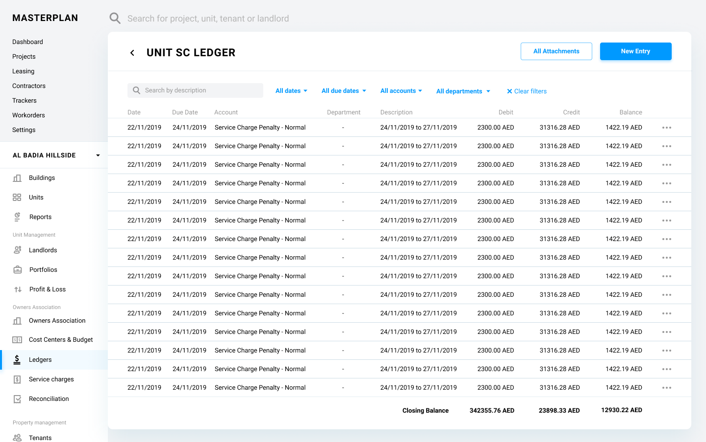

# MasterPlan

Project is designed to provide home for all the automation that is required by the Kaizen Asset Management Services (KAMS).

Please use sidebar to browse through this documentation.

# Ledger

A ledger is the principal book for recording and totaling economic transactions measured in terms of a monetary unit of account by account type, with debits and credits in separate columns and a beginning monetary balance and ending monetary balance for each account and period.

Every financial transaction which occurs in the system generates one or more journal entries bound to a ledger according to the generally accepted accounting principles.

Details of the transactions are provided through out the system process definitions.

# Ledger Properties

Ledger entity corresponds to “ledger” table in the database which has the following fields:

| Property  | Type   | Reference | Reference To | Description | Method
| ------    | ------ | ------    | ------       | ------      | ------
id|Int|PK|-|Unique Identifier|Auto generated
name|Text|-|-|-|User entry
type|Text|FK|Ledger Type|Ledger Type|Dropdown
company|Int|FK|Contact|The company that the ledger is assigned to|Searchable Dropdown
unit|Int|FK|Unit|The unit that the ledger is assigned to|Searchable Dropdown
landlord|Int|FK|Contact|The landlord that the ledger is assigned to|Searchable Dropdown
tenant|Int|FK|Tenancy|The tenant that the ledger is assigned to|Searchable Dropdown
project|Int|FK|Project|The project that the ledger is assigned to|Searchable Dropdown

# Constraints on the Ledger Types
For each ledger type below table shows which fields can be assigned. 

>  Please note: Since the owners association is now part of the project entity, OA column from below table is removed.

| Ledger Type        | Company| Unit      | Landlord | Project| Tenant
| ------             | ------ | ------    | ------   | ------ | ------
| General Ledger     | Yes    | ------    | ------   | ------ | ------
| Tenant Ledger      | ------ | Yes       | ------   | ------ | Yes
| Landlord Ledger    | ------ | Yes       | Yes      | ------ | ------
| Landlord SC Ledger | ------ | Yes       | Yes      | ------ | ------
| Project Ledger     | ------ | ------    | ------   | Yes    | ------
| OA Ledger          | ------ | ------    | ------   | Yes    | ------
| Vendor Ledger      | Yes    | ------    | ------   | ------ | ------

*General Ledger:* This type of ledger is used to keep accounting entries for our own companies, defined in the “Company” entity with the type of “Our Own”. E.g. Kaizen FZ LLC.

*Tenant Ledger:* This type of ledger is used to keep accounting entries for the tenants in our units.

*Landlord Ledger:* This type of ledger is used to keep accounting entries for the owners of our units. Service charge entries can’t be posted to this ledger.

*Landlord Service Charge Ledger:* This type of ledger is used to keep accounting entries for the service charge invoices and relevant postings.

*Project Ledger:* This type of ledger is used to keep accounting entries for the projects we manager for our clients.

*Owners Association Ledger:* This type of ledger is used to keep accounting entries for the owners associations managed by our system.

*Vendor Ledger:* This type of ledger is used to keep accounting entries for service providers and suppliers.

# Ledger User Interface

Ledger UI facilitates a data grid component to display the entries. None of the cells are editable due to the nature of the accounting principles. If the user needs to delete a Journal Entry, a reversal Journal Entry should be posted using “Manual Journal Entry Creation” process.

When the UI needs to represent multiple ledgers for an entity, such as Unit entity, the system needs to provide a mechanism to pick the desired ledger. In these cases, when the “” icon is clicked, the system opens a modal screen and shows all the currently active and/or all the archived ledgers of the entity. Once the user selects a ledger, the system closes the modal screen and shows the transactions in the ledger. 

# Ledger Create

Throughout the system, creation of entities define the insertion of the ledger tuples in the "ledger" table of the system database.

Below the ledger creation scenarios can be seen per each ledger type.

## General Ledger
This ledger tuple is inserted every time a tuple is inserted to "contact" table with the type "Internal Company". During the insertion of the ledger tuple, "company" field should be populated with the id of the contact tuple inserted.

## Tenant Ledger
This ledger tuple is inserted every time a tuple is inserted to "tenancy" table. During the insertion of the ledger tuple, "tenant" field should be populated with the id of the tenancy tuple inserted.

## Landlord Ledger
This ledger tuple is inserted every time a tuple is inserted to "landlord" table. During the insertion of the ledger tuple, "landlord" field should be populated with the id of the landlord tuple inserted.

## Landlord Service Charge Ledger
This ledger tuple is inserted every time a tuple is inserted to "landlord" table. During the insertion of the ledger tuple, "landlord" field should be populated with the id of the landlord tuple inserted and the "unit" field should be populated with the "unit_id" of the landlord tuple inserted.

## Project Ledger
This ledger tuple is inserted every time a tuple is inserted to "project" table. During the insertion of the ledger tuple, "project" field should be populated with the id of the project tuple inserted.

## Owners Association Ledger
This ledger tuple is inserted every time a tuple is inserted to "project" table. During the insertion of the ledger tuple, "project" field should be populated with the id of the project tuple inserted.

## Vendor Ledger
This ledger tuple is inserted every time a tuple is inserted to "contact" table with the type "Vendor Company". During the insertion of the ledger tuple, "company" field should be populated with the id of the contact tuple inserted.

# Ledger Type
Ledger Type is a pseudo entity related to the entity “Ledger” in the system that is referred to as the type of the ledger.

Definition of the behavior of Ledger Type entity is defined in the Type Definition User Interface.

## Ledger Type Properties
Ledger Type entity corresponds to “ledger_type” table in the database which has the following fields:

| Property  | Type   | Reference | Reference To | Description | Method
| ------    | ------ | ------    | ------       | ------      | ------
name|Text|PK|-|Name of the Type|Auto generated
position|Int|-|-|Position of the type in the list in any UI Component|Drag&Drop

## Ledger Type Default List
* General Ledger
* Tenant Ledger
* Landlord Ledger
* Unit SC Ledger
* Project Ledger
* OA Ledger
* Vendor Ledger

# Journal Entry

Journal entries are the first step in the accounting cycle and are used to record all business transactions and events in the accounting system. As business events occur throughout the accounting period, journal entries are recorded in the “Ledger”.

## Journal Entry Properties

Journal Entry entity corresponds to “journal” table in the database which has the following fields:

| Property  | Type   | Reference | Reference To | Description | Method
| ------    | ------ | ------    | ------       | ------      | ------
id|Int|PK|-|Unique Identifier|Auto generated
journal_invoice|Int|FK|Invoice|-|Auto assigned
journal_account|Int|FK|Account|Assigned account|Auto assigned / Searchable Dropdown
journal_department|Int|FK|Department|Assigned department|Auto assigned / Searchable Dropdown
journal_cost_center|Int|FK|Cost Center|Assigned cost center|Auto assigned / Searchable Dropdown
journal_posted_by|Int|FK|Contact|Who posted the journal|Auto assigned
posting_date|Date|-|-|When the journal posted|Auto assigned
date|Date|-|-|Real transaction date|Datepicker
description|Text|-|-|-|User entry
debit|Float|-|-|Debit Value|Auto assigned / User entry
credit|Float|-|-|Credit Value|Auto assigned / User entry
journal_bank_account|Int|FK|Bank||Searchable Filtered Dropdown
bank_transaction_id|Text|-|-|-|Auto assigned / User entry

## Journal Entry Processes

### Journal Entry List

Journal entries are always listed as a line in the ledgers. The process is described in the “Ledger User Interface” section of this document.

### Journal Entry Create

There are two methods for creation, namely, Manual & Automated.

#### Journal Entry Manual Create

Manual Journal Entry can only be used for non-standard cases. For

On the “Ledger User Interface” user has access to “Manual Entry” button. Upon click of this button a modal interface is shown as below:

Ledger will be auto assigned as the screen is opened directly from the ledger screen.

Attachments will be listed using Listing Documents process, and can be added for a tenancy using Uploading Documents process.

Notes will be listed using Listing Notes process, and can be added for a tenancy using Creating Note process.

Cancel button cancels the process and returns to the previous screen while Save button initiates the transaction recording. 

* [ ] @alidikici Phase 2: According to the transaction’s account and ledger the behavior of posting to debit or credit changes. List all the possible scenarios and automate the entry’s side instead of entering debit / credit on the screen>

<!-- # Table of Contents

[Scenarios](Scenarios)  
[Scheduled Tasks](Scheduled Tasks)  
[Communication Templates](Communication Templates)  

[Recency](./content/Recency.md)  
[Landlord](./content/Landlord.md)  
[Tenancy](./content/Tenancy.md)  
[Tenancy Status](./content/TenancyStatus.md)  
[Building](./content/Building.md)  
[Budget](./content/Budget)  
[Budget Status](./content/BudgetStatus.md)  
[Budget Type](./content/BudgetType.md)  
[Budget Driver](./content/BudgetDriver.md)  
[Budget Item](./content/Budget Item)  
[Portfolio](./content/Portfolio)  
[Invoice](./content/Invoice.md)  
[Account](./content/Account.md)  
[Department](./content/Department.md)  
[Complaint](./content/Complaint.md)  
[Workorder](./content/Workorder.md)  
[Governance Structure](./content/GovernanceStructure.md)  
[Bank Account](./content/BankAccount.md)  
[Bank Account Type](./content/BankAccountType.md)  
[Document](./content/Document.md)  
[Document Type](./content/DocumentType.md)  
[Reference](./content/Reference.md)  
[Note](./content/Note.md)  
[NoteType](./content/NoteType.md)  
[Contact](./content/Contact)  
[Contact Type](./content/Contact Type)  
[Contact Reference](./content/ContactReference.md)  
[Contact Function](./content/ContactFunction.md)  
[Service Category](./content/ServiceCategory.md)  
[User](./content/User.md)  
[Persona](./content/Persona.md)  
[Type Definition User Interface](./content/TypeDefUI.md)  
[Settings](./content/Settings.md)  
[Integrations](./content/Integrations.md)  

 -->