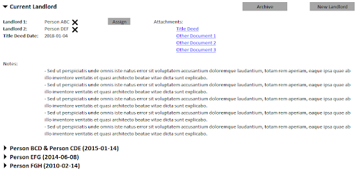
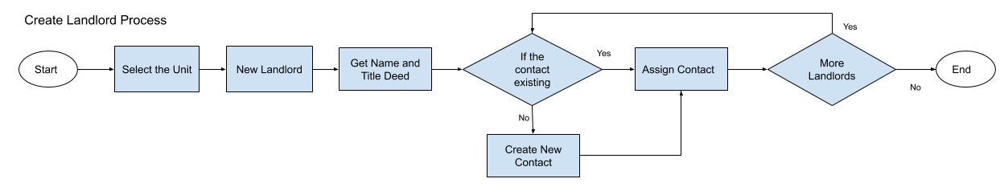

# Definition
Landlord entity defines the ownership of units with contacts. 

# Properties
Landlord entity corresponds to “landlord” table in the database which has the following fields:

| Property  | Type   | Reference | Reference To | Description | Method
| ------    | ------ | ------    | ------       | ------      | ------
id|Int|PK|-|Unique Identifier|Auto generated
unit|Int|FK|Unit|-|Assigned automatically by the UI definition
isCurrent|Bool|-|-|-|-
ownedOn|Date|-|-|Date on the title deed|Date Picker

# Processes

## List

Landlords tab under Unit details UI uses and accordion UI interface to display the future, current and past landlords. 

Landlords are ordered title deed date descending ordered.

By default, when the tab is visited, currently active landlord details are expanded in the accordion UI and user can click to collapse and expand the individual accordion panels.

Click of the contact name opens a modal screen to show the contact details.

## Assign
Assign button next to the landlord items in the UI opens Assigning Contact UI on a modal screen. Please refer to the functionality on the section Assigning Contact.

## Unassign

When a user clicks to the cross button next to the contacts name on the UI, the system asks for a confirmation and upon confirmation, contact is unassigned from landlord definition.

## Create

When the unit is first defined in the system, and/or when the owner of a unit changes, there will be a need to create a new landlord definition. When the user clicks to “New Landlord” button, below steps should be taken by the system:
* Confirm the new landlord creation and also ask for the title deed date.
* On the system database open a transaction and within the transaction complete below:
    * Begin PostgreSQL Transaction.
    * Create a new tuple in landlord table
    * Retrieve the created landlord tuple id
    * Create a new tuple in ledger table
        * Landlord: New landlord id
        * Unit: The id of the unit in which the landlord is defined
        * Type: Landlord Ledger
    * Create a new tuple in ledger table
        * Landlord: New landlord id
        * Unit: The id of the unit in which the landlord is defined
        * Type: Unit SC Ledger
    * * [ ] Phase 2: Throw a reverse transaction to the previous landlord’s Unit SC Ledger in a prorated amount and throw a SC transaction to the new landlord’s Unit SC to move the prorated service charge to the new landlord>
    * Commit the PostgreSQL transaction.

## Delete

* [ ] @alidikici to complete definition