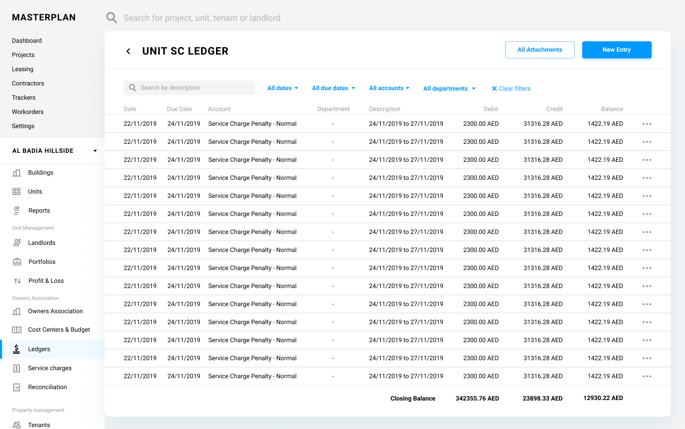

# Definition

A ledger is the principal book for recording and totaling economic transactions measured in terms of a monetary unit of account by account type, with debits and credits in separate columns and a beginning monetary balance and ending monetary balance for each account and period.

Every financial transaction which occurs in the system generates one or more journal entries bound to a ledger according to the generally accepted accounting principles.

Details of the transactions are provided through out the system process definitions.

# Properties
Ledger entity is not represented in the database as a separate collection but as an element in the other entities' objects. 

Each ledger comprises of several shards and stored in the database in the below manner.

```
[
    'shard_id_1', 
    'shard_id_2', 
    ..., 
    'shard_id_n'
]
```
# Ledger Shards
Due to the nature and limitations of the Firestore database, every Firestore object can have the maximum size of a 1MB. However, some ledgers can have enough number of journal entries, which can exceed this limit. On the other hand, it is not logical to store all the journal entries as a separate object in the database due to the cost concrens.

In order to mitigate these limitations, we will be storing the data in shards in the "shard" collection of the database. 

As a principle each shard can have a maximum of 1000 journal entries in an array, so when the data is queried, only one read operation occurs per shard. 

# Constraints on the Ledger Types
For each ledger type below table shows which fields can be assigned. 

>  Please note: Since the owners association is now part of the project entity, OA column from below table is removed.

| Ledger Type        | Company| Unit      | Landlord | Project| Tenant
| ------             | ------ | ------    | ------   | ------ | ------
| General Ledger     | Yes    | ------    | ------   | ------ | ------
| Tenant Ledger      | ------ | Yes       | ------   | ------ | Yes
| Landlord Ledger    | ------ | Yes       | Yes      | ------ | ------
| Landlord SC Ledger | ------ | Yes       | Yes      | ------ | ------
| Project Ledger     | ------ | ------    | ------   | Yes    | ------
| OA Ledger          | ------ | ------    | ------   | Yes    | ------
| Vendor Ledger      | Yes    | ------    | ------   | ------ | ------

*General Ledger:* This type of ledger is used to keep accounting entries for our own companies, defined in the “Company” entity with the type of “Our Own”. E.g. Kaizen FZ LLC.

*Tenant Ledger:* This type of ledger is used to keep accounting entries for the tenants in our units.

*Landlord Ledger:* This type of ledger is used to keep accounting entries for the owners of our units. Service charge entries can’t be posted to this ledger.

*Landlord Service Charge Ledger:* This type of ledger is used to keep accounting entries for the service charge invoices and relevant postings.

*Project Ledger:* This type of ledger is used to keep accounting entries for the projects we manager for our clients.

*Owners Association Ledger:* This type of ledger is used to keep accounting entries for the owners associations managed by our system.

*Vendor Ledger:* This type of ledger is used to keep accounting entries for service providers and suppliers.

# User Interface



Ledger UI facilitates a data grid component to display the entries. None of the cells are editable due to the nature of the accounting principles. If the user needs to delete a Journal Entry, a reversal Journal Entry should be posted using “Manual Journal Entry Creation” process.

When the UI needs to represent multiple ledgers for an entity, such as Unit entity, the system needs to provide a mechanism to pick the desired ledger. In these cases, when the “” icon is clicked, the system opens a modal screen and shows all the currently active and/or all the archived ledgers of the entity. Once the user selects a ledger, the system closes the modal screen and shows the transactions in the ledger. 

# Processes

## Create

Throughout the system, creation of entities define the insertion of the ledger tuples in the "ledger" table of the system database.

Below the ledger creation scenarios can be seen per each ledger type.

### General Ledger
This ledger tuple is inserted every time a tuple is inserted to "contact" table with the type "Internal Company". During the insertion of the ledger tuple, "company" field should be populated with the id of the contact tuple inserted.

### Tenant Ledger
This ledger tuple is inserted every time a tuple is inserted to "tenancy" table. During the insertion of the ledger tuple, "tenant" field should be populated with the id of the tenancy tuple inserted.

### Landlord Ledger
This ledger tuple is inserted every time a tuple is inserted to "landlord" table. During the insertion of the ledger tuple, "landlord" field should be populated with the id of the landlord tuple inserted.

### Landlord Service Charge Ledger
This ledger tuple is inserted every time a tuple is inserted to "landlord" table. During the insertion of the ledger tuple, "landlord" field should be populated with the id of the landlord tuple inserted and the "unit" field should be populated with the "unit_id" of the landlord tuple inserted.

### Project Ledger
This ledger tuple is inserted every time a tuple is inserted to "project" table. During the insertion of the ledger tuple, "project" field should be populated with the id of the project tuple inserted.

### Owners Association Ledger
This ledger tuple is inserted every time a tuple is inserted to "project" table. During the insertion of the ledger tuple, "project" field should be populated with the id of the project tuple inserted.

### Vendor Ledger
This ledger tuple is inserted every time a tuple is inserted to "contact" table with the type "Vendor Company". During the insertion of the ledger tuple, "company" field should be populated with the id of the contact tuple inserted.