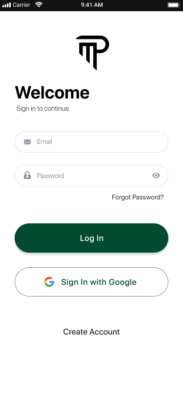
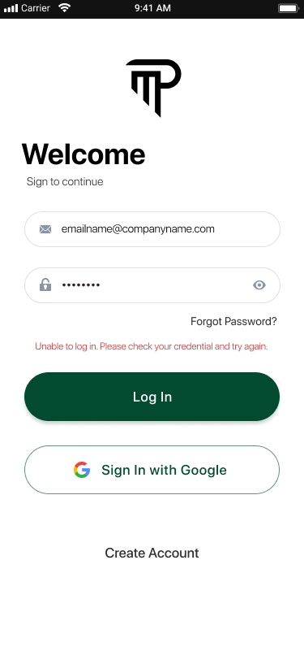
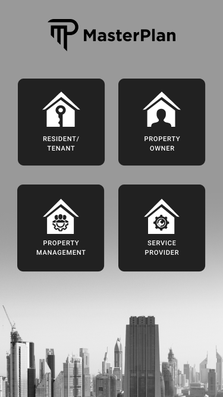

System users should have an entry point to the system.  
Naturally this entry point is the login screen on both mobile and web applications.

Below is the design of the login screen:

If the password is wrong, system should show the below screen:

Since a user can have multiple personas, below screen is introduced to the user if the user have multiple roles:

An example of this multiple persona situation is that, a landlord can be a tenant at another property at the same time. Or a service provider can also be an owner to one of our managed units.

So, if there are multiple personas, we should have this intermediary screen for the user to interact with the system with each login.

Once the persona is selected it should proceed to the correct view of the application. 

For the users with only one persona, this page will not be shown and skipped.

A user definition can be assigned to multiple contacts in the system as defined in the "Contact" entity documentation.

As a result, there are two steps to list all the personas for a single user:
* List all the contacts assigned to the user
* List all the contact_assignments assigned to each of the contacts

The joint list of these two queries will give the list of possible assigned personas for a user.

Each of the personas' scenarios are listed in the "Scenarios" section of this documentation.