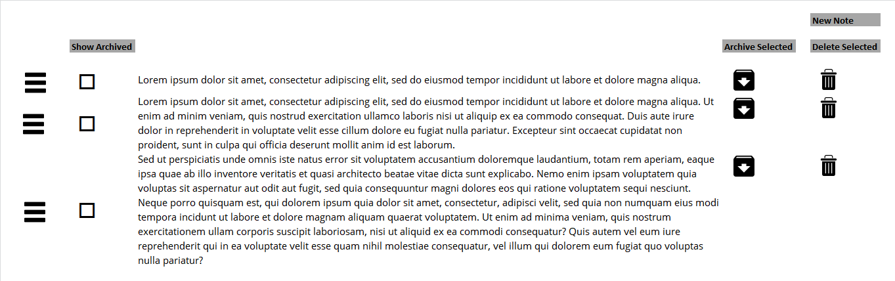
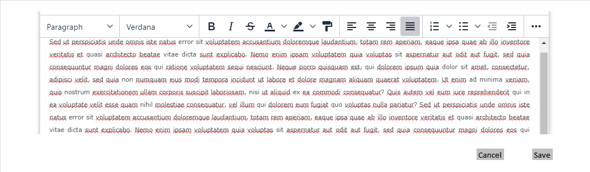

# Definition

Throughout the system, there are many points a user can assign a note as a description of an entity. Note entity is created in order to accommodate this need in the system. Note entity tuples are all recorded under the note table described with the below properties.

# Properties

Note entity corresponds to “note” table in the database which has the following fields:

| Property  | Type   | Reference | Reference To | Description | Method
| ------    | ------ | ------    | ------       | ------      | ------
id|Int|PK|-|Unique Identifier|Auto generated
content|Text|-|-|Content of the note|User entry
note_type|Text|FK|Note Type|-|Read-only
note_reference|Int|FK|Reference|-|Read-only
note_referrer|Int|FK|Many|Refer to the below description|Read-only
created_at|Timestamp|-||-|Read-only
isCurrent|Bool|-|-|Refer to the below description|Checkbox
deleted_at|Timestamp|-|-|Archival timestamp of the note. A non-null value means that the note is archived.|-
position|Int|-|-|Refer to the below description|Drag&Drop

# Referrers

Each note that is created in the system has to have a referrer and a Reference. 

Reference denotes to the entity that the document is bound to. Such as, if the Reference is Unit, the note is a Unit’s note, and if the Reference is Contact, the note is a Contact’s note.

Referrer is the id of the referring Entity. Such as, if the Reference is Unit and the referrer is 192, this means that the note is bound to the Unit which has the id field value as 192.

# Processes

## List

Notes are listed in a tabular format in the system. 

Above the listing, there can be several buttons:

* Delete Selected: If there are selected items using the selection checkboxes in the list, this button gets activated. If there is no selection, button will be disabled. Delete process is described in the following sections.
* Archive Selected: If there are selected items using the selection checkboxes in the list, this button gets activated. If there is no selection, button will be disabled. Archive process is described in the following sections.
* New Note: This button activates the note creation process described in the following section.

The fields of the listing table is listed as below:

* (Phase 2) Drag & Drop Handle: Using this handle user can reorder the notes. Reordering result changes the position field in the tuples of the note table.
* (Phase 2) Selection Checkbox: List items can be selected using these checkboxes for the bulk actions.
* Content: Content of the note goes here. 
* Archive Button: Archiving the note. Please refer to archiving notes section of this document.
* Delete Button: Deleting the note. Please refer to deleting notes section of this document. 

All the note displays occur in the corresponding Entity sections of the system. Such as, all the notes related to a unit are listed under the Unit Detail user interface.

All the note displays are ordered using the position field referred to in the database table. 

Note list should be searchable via content.

## Create

Notes are created in the system using a modal screen as shown below:

When the “New Note” button is clicked on the note listing screen, a modal screen containing a rich text editor and “Cancel” and “Save” buttons.

As a side note, the referring UI might require normal text editor, in this case, this functionality should be provided to the user.

Cancel button cancels the process and returns to the note listing.

Esc button on the user’s keyboard cancels the process and returns to the note listing.

Once the content is populated “Save” button saves the note to the system database.

Each note creates a record in the “note” table of the system database.

* content field should be populated with the entered formatted text in HTML format.
* reference field should be assigned to the corresponding Reference. Such as, if the note is created from the Unit user interface, Reference should mention the corresponding Reference.
* referrer field should be assigned to the corresponding entity’s unique identifier from the corresponding table. 
* created_on field should be set as the current date/time.
* position field of the file should be set to (Maximum + 1) of the currently existing documents’ position field. 

As soon as the note is saved in the system database, the note modal should close automatically. As soon as the modal screen closed, the note listing should be updated from the database and all the previously existing and the newly created notes should be listed in the list.

## Archive

Archival of notes can be triggered in two ways. 

* Clicking the button on the notes’ row’s “Archive” button.
* (Phase 2) Selecting multiple notes from the list and  clicking the button “Archive Selected”.

Upon this trigger, the system should confirm with the user and if confirmed should update the field deleted_at as current timestamp for the selected tuples. In the system this change marks tuples as archived.

## Show Archived

In the note listing UI, if the user clicks the “Show Archived” system will only list the archived notes. 

## Unarchive

When the list is showing archived documents, archive button changes to unarchive. If the Unarchive button is clicked, the system should confirm with the user and if confirmed should update the field is Archived as false for the tuple.

## Delete

Deletion of notes can be triggered in two ways.

* Clicking the button on the notes’ row’s “Archive” button.
* (Phase 2) Selecting multiple notes from the list and clicking the button “Delete Selected”.

Upon this trigger, the system should confirm with the user and if confirmed should delete the tuples from the database.

