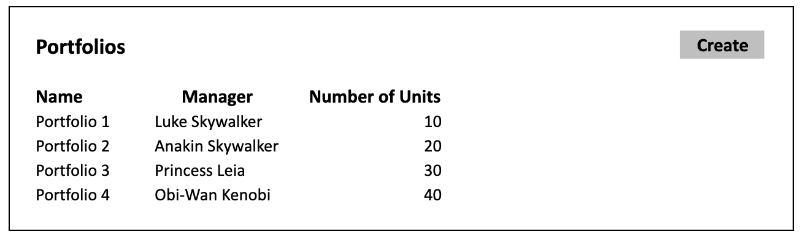
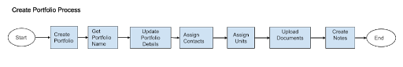
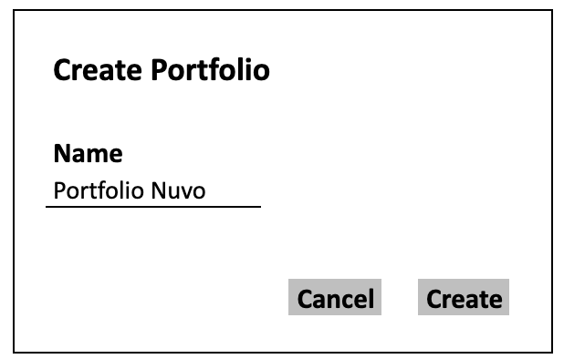
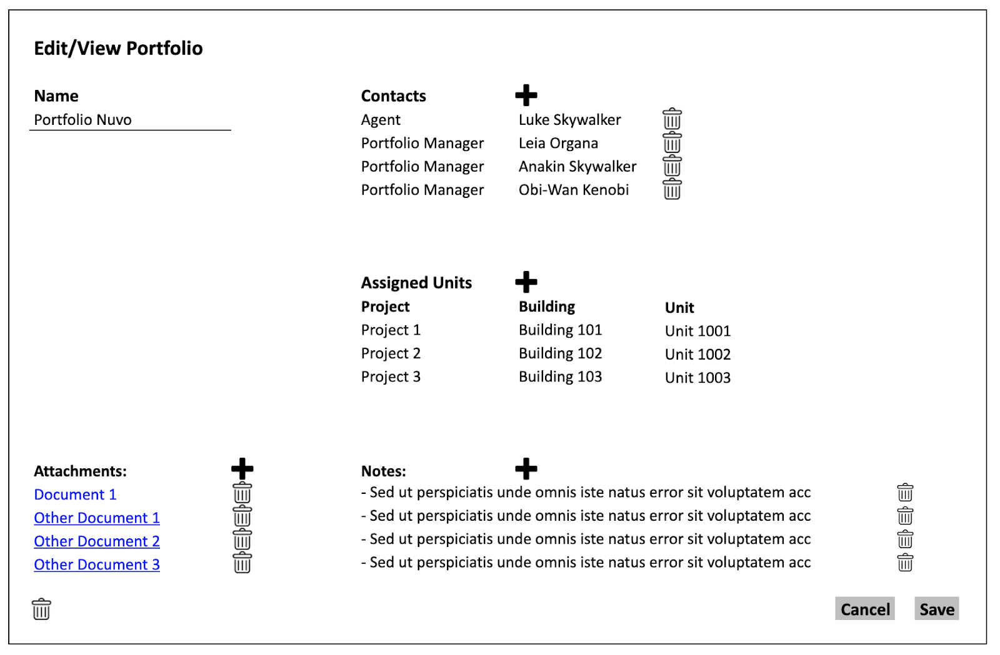

# Definition
A portfolio is a group of units managed by one or more “Contact” instances in the system. Portfolio entity defines the management structure of a group of units within the system. 

# Properties

Portfolio entity corresponds to “portfolio” table in the database which has the following fields:

| Property  | Type   | Reference | Reference To | Description | Method
| ------    | ------ | ------    | ------       | ------      | ------
id|Int|PK|-|Unique Identifier|Auto generated
name|Text|-|-|-|User entry
ownedOn|Date|-|-|Date on the title deed|Date Picker

# Processes

## List

System should list the portfolios in a tabular format as represented below:

Click action on any of the columns should take the system to the “Edit/View Portfolio” screen of the system.

Click action on “Create” button initiates “Create Portfolio” process.

## Create

When “Create” button is clicked on the “Listing Portfolios” screen, a modal dialog opens and asks only for the “Name” of the new portfolio as represented in the below screenshot. 

Create: Creates the portfolio in the system database. Following the creation, system takes the user interface to the newly created portfolio details screen as explained below.

Cancel: Cancels the creation and rolls back to portfolio listing.

## Edit/View

Name: Name of the portfolio.

Assigned Units: List of the units assigned to the portfolio.

* [ ] Phase 2: Quick unit creation screen for the portfolios>>

Attachments will be listed using Listing Documents process, and can be added for a Portfolio using Uploading Documents process.

Notes will be listed using Listing Notes process, and can be added for a Portfolio using Creating Note process.

Assign Contacts: Click action of the plus button next to the “Contacts” header on the screen should open a new modal UI and initiate the “Assign Contact” process. From this list user should be able to assign contacts and their functions to the portfolio. 

Assign Units: Click action of the plus button next to the “Assigned Units” header on the screen should open a new modal UI and represent the list of unassigned units. From this list user should be able to assign the available units to the portfolio.
