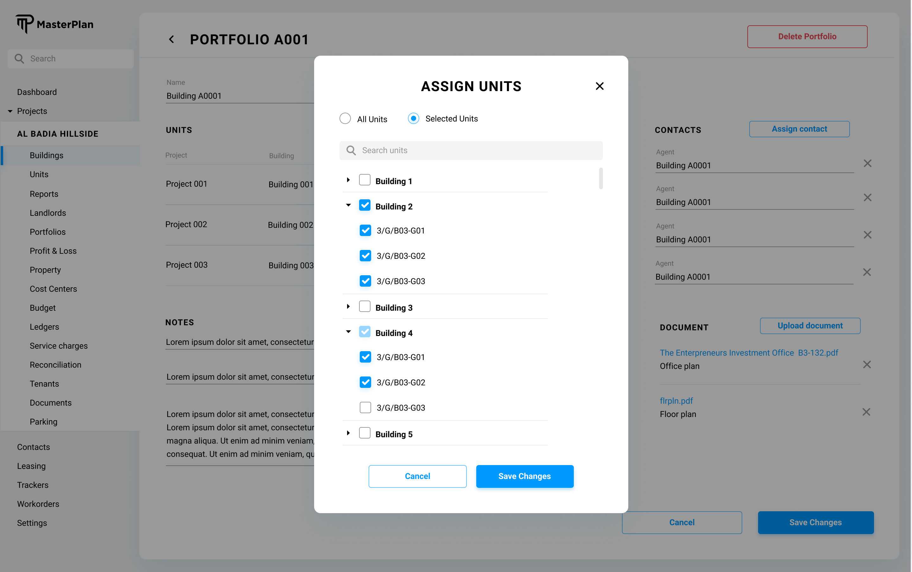
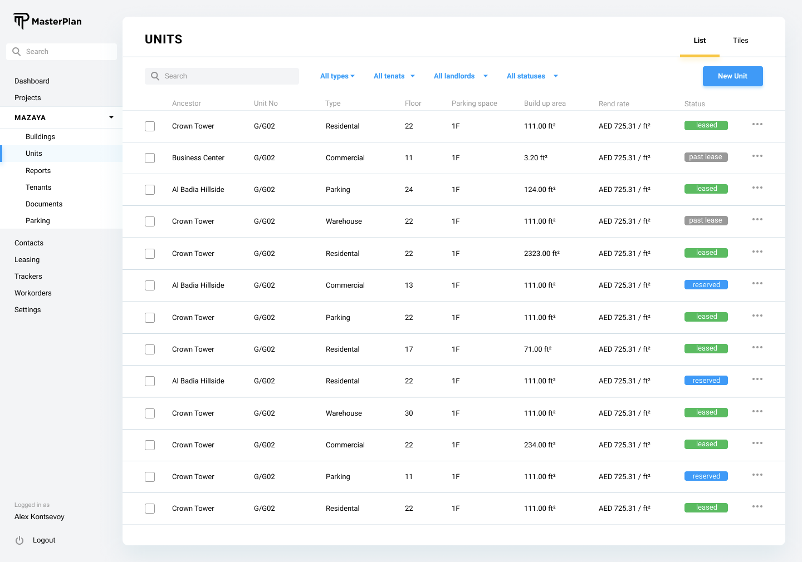
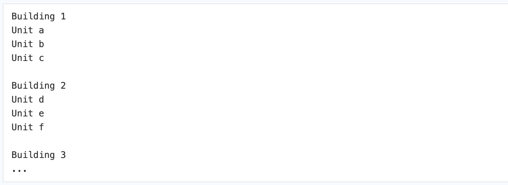
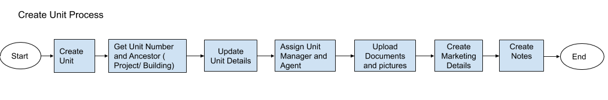
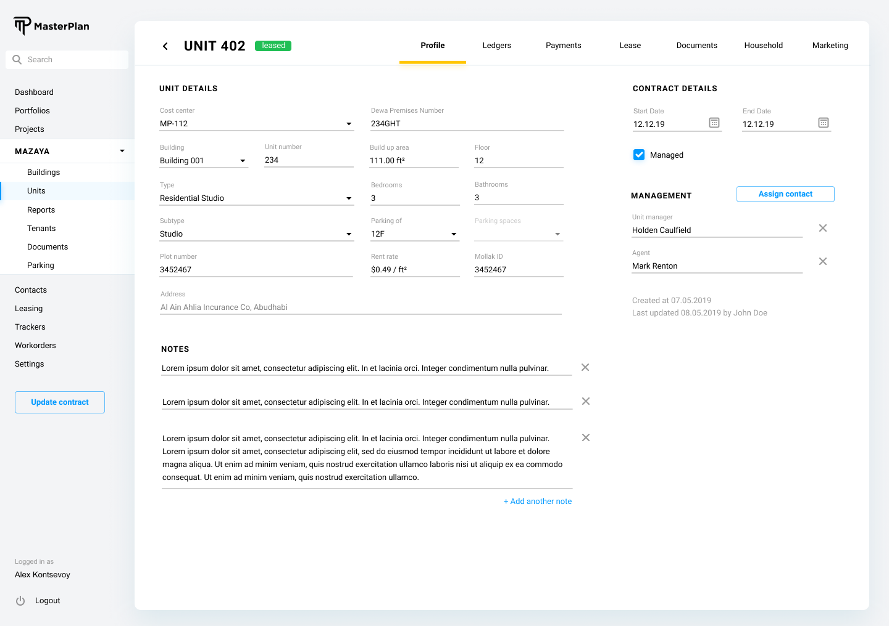
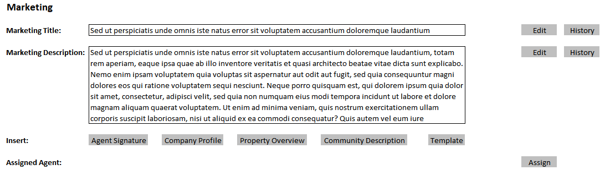

# Definition

Unit is the primary building block of all the business lines KaizenAMS operates in. 

# Properties
All the units in the system are recorded in the units table in the system database, irrespective of the business line. 

Unit entity corresponds to “unit” table in the database which has the following fields:

| Property  | Type   | Reference | Reference To | Description | Method
| ------    | ------ | ------    | ------       | ------      | ------
id|Int|PK|-|Unique Identifier|Auto generated
name|Text|-|-|Name/Number of the Unit|User entry
unit_type|Text|FK|Unit Type|Refer to below list of types|Referred dropdown
unit_subtype|Text|FK|Unit Subtype|Refer to below list of types|Referred dropdown
unit_building|Int|FK|Building|Building the unit belongs to|Searchable dropdown
unit_cost_center|Int|FK|Cost Center|Cost Center the unit is assigned to|Searchable dropdown
unit_portfolio|Int|FK|Portfolio|Portfolio the unit belongs to|Searchable dropdown
plot|Text|-|-|Name of the plot from title deed|User entry
area|Float|-|-|Build up Area of the Unit|User entry
floor|Int|-|-|In which floor the Unit in the building|User entry
parkings|Calc|-|-|Number of parking spaces|Automatically calculated
bedrooms|Int|-|-|Number of bedrooms|User entry
bathrooms|Int|-|-|Number of bathrooms|User entry
parking_of|Int|FK|Unit|If unit type is parking, this parking unit might be bound to another unit|Searchable dropdown
is_managed|Bool|-|-|Identifies if the unit is managed by Unit Management|Checkbox
dewa_id|Text|-|-||User entry
created_on|Date|-|-|Creation date of the tuple|Auto generated
last_update|Date|-|-|Any update action should trigger the update|Auto generated
unit_tenancy_status|Text|FK|Tenancy Status|Tenancy Status of the unit|Dropdown
mollak_id|Text|-|-||User entry
access_management_definitions|JSON|-|-|Phase 2|Phase 2

# Ancestors Analysis

In different business lines, a unit is accounted under different hierarchies.

Unit Management Business Line: A unit is assigned to a building and also to a portfolio. As a result, only “building” and “portfolio” fields should be populated in the database tuple.

Property Management Business Line: A unit is assigned to a building. As a result, only “building” field should be populated in the database tuple.

Owners Association Management Business Line: A unit is assigned to a building and also to a cost center. As a result, only “building” and “cost_center” fields should be populated in the database tuple.

If a unit belongs to more than one business line, in this case, the unit assignments will be done on a union basis.

# Processes

## Unit Assignment

A unit can be assigned to a portfolio, cost center or other entities using this process. 
The user interface is defined as above.

## List

Unit listing will be done in a tabular format with the following columns, represented from the corresponding fields from the "unit" table in the system database:

* Unit No: Text field. Click action on an item on this column takes the system to the details of the unit.
* Type: Display only. 
* Floor: Display only.
* Building: Click action on an item on this column takes the system to the building’s profile page with the corresponding screen.
* Cost Center: Click action on an item on this column takes the system to the cost center’s profile page with the corresponding screen.
* Portfolio: Click action on an item on this column takes the system to the portfolio’s profile page with the corresponding screen.
* Actions: This column displays an ellipsis button for further actions. 
    * Archive Unit: Requires confirmation modal dialog.

There are additional action items on the Unit listing screen, listed below:
* Create: This button opens a modal dialog described in the below “Creating a Unit” section.
* Import: This button opens a modal dialog described in the below “Importing Units” section.
* Filter: 
    * Each filter opens a searchable drop down for user to be able to filter the units according to the selection.

* [ ]  Phase 2: Implement Group By functionality

## Create

When “Create” button is clicked on the “Listing Units” screen, a modal dialog opens and asks only for the “Unit No” and the direct ancestor (Building/Project/Cost Center, etc). 

Two buttons on the modal screen should exist. 

Create: Creates the unit. Following the creation takes the user interface to the newly created unit details screen explained below.

Cancel: Cancels the creation and rolls back to unit listing.

## Tenancy Status Automatic Update

Phase 1: Tenancy Status will be updated by Kaizen AMS team members.

Phase 2:  
* [ ] The tenancy status of a unit should be automatically updated by the system.

1. Unit Tenancy Status - Vacant
    * Once the End date of the Tenancy record is passed, Unit status will be changed to Vacant by the system, if there is no new Tenancy record available with next start day
    * User will have the option to update the Unit Details in the below Modal form to provide more details of the Vacant Unit
2. Tenancy Status - New
    * Behavior of the New Lease is defined at Tenancy entity definition.
    * Lease agreement will be sent to Landlord for the Approval
    * Based on the Start of the Lease, system will update the unit status to Leased and make the new lease as current
3. Tenancy Status - Upcoming
    * When the end date - 120 days approaches, system will update the status of unit to Upcoming
    * Upcoming notification to be sent to the Property Manager, Listing Agent, Landlord and Tenant
4. Tenancy Status : Renew
    * Renew Lease will be created in the same New Lease UI, Tenant details will be pre-filled with the current Tenant details.
    * Generate Lease Agreement button should be enabled for the Lease.  Lease agreement document will be generated as per the Ejari Template 
    * Lease agreement will be sent to Tenant for Sign.
    * Lease agreement will be sent to Landlord for the Approval
5. Tenancy Status - Legal
    * When we change the Tenancy status to Legal, we will have below  Modal form with 2 options: 
        * Expired
        * Returned

    * User should be able to upload below 3 supporting documents for Expired
        * Late Payment Notice
        * Notarized Legal Notice
        * Final Notice 
    * User should be able to upload below 3 supporting documents for Returned
        * Returned cheque notice
        * Notarized Legal Notice
        * Final Notice
    * Once the details are provided, Tenancy Status is changed to "Legal".
    * An additional option is available in the actions: "Resolved Legal" - will change status to "Resolved Legal".
    * Note: Legal case have 2 scenarios
        * Under Legal but the Tenant is still occupying the unit.
        * Tenant already abandoned the unit and the unit should b erecovered through the authority

## Edit/View

Unit details user interface employs a tabbed interface. Each tab and functionality is described in the following subsections.

### Profile Tab

>  Please note the above design is picked from an older design. @ekucherenko to update

Fields editable in this tab are as follows:
* Managed Unit: Checkbox
* Cost Center: Dropdown
* Building: Dropdown
* Unit Number: Text
* Type: Dropdown
* Subtype: Dropdown
* Plot Number: Text
* Dewa Premises Number: Text
* Build up Area: Float
* Floor: Int
* Bedrooms: Int
* Bathrooms: Int
* Parking of: This field is enabled if the type of the unit is parking. Once enabled, this field will become a searchable dropdown of units, filtered by the same building.
* Parking Spaces: This field is enabled if the type of the unit is not parking. To edit, a multiselect component should be shown, filtered by the parking typed units at the same building, and further filtered by the assignment status. If a parking unit is assigned to a unit, it can’t show up on this list. If not in edit mode, list of the names (number) of the parking units are displayed.
* Rent Rate: Float per square feet
* Address: A unit’s address is bound to the building. Therefore, Unit address will be referred from the building address.
* Notes: At this section, the user interface described in the Listing Notes section of this document will be used.
* Unit Manager: Unit manager is assigned to the unit using “Assigning Contact” process.
* Agent: Unit agent is assigned to the unit using “Assigning Contact” process.
* Last Updated: Any data change in the unit details triggers un update query on this field of the unit tuple.
* Mollak ID: Mollak data integration identifier with text type and user entry.
* Managed: Checkbox to define if the unit is managed by our Unit Management Business Line.
* Management Fee: Amount in UAE Dirhams per year for the management services.
* Management Start Date: Date of the management contract start.
* Management End Date: Date of the management contract end.

### Documents Tab
Documents referred to in this tab are recorded under the documents table of the database of the system. Please refer to the Document section of this document for further details.

Listing of unit documents will be done as described in the Listing Documents section. 

Listing documents UI on this tab should filter only the type of documents which are not “Marketing Images”. These documents will be listed under the “Pictures Tab” as described in the following section.

Listing documents UI should also provide the “Generate Document Template” functionality with the following list of templates:

* Request to approve quotation
* Acknowledgement
* Lease Agreement
* Bounced Cheque Notice
* HSE Notice
* Lease Renewal Notice
* Service Charges Arrears Notice
* Rent Arrears Notice
* Vacating Notice

* [ ] (Phase 2): Should the system offload some of these items to the automated communication channels. This discussion is left to the phase 2 of the implementation

### Pictures Tab

* [ ] @alidikici Pictures tab and marketing tab should be merged

Pictures referred to in this tab are also recorded under the documents table of the database of the system. Please refer to the Document section of this document for further details.

Listing of the unit pictures will be done as described in the Listing Documents section. 

Listing documents UI on this tab should filter only the “Marketing Images” type of the documents for the listing.

UI should provide means to sort the pictures. The sort order will be recorded under the position field of the “Document” table.

* [ ] (Phase 2): Updating images in this area should initiate the data integration between Masterplan and Unit listing portals

### Marketing Tab

Marketing tab is used to identify the unit’s marketing title, marketing description and agent(s). The UI of this tab should contain functionalities both pictured and explained below.

*Please note, the design sample is missing the second marketing description field, please provide two marketing description fields for the marketing tab*

* Marketing Title: This field is a representation of “Note” entity in the system. 
    * Edit: If the user clicks to “Edit” button, a modal screen as described in the “Creating Note” section should be activated with the “normal text editor” flag. This should disable the rich text editor, and the field will become a normal html textarea field.  Once the new “Note” tuple is saved on the database, the previous note tuple’s deleted_at field should be assigned with current timestamp and the new “Note” should be shown as “Marketing Title”.
    * History: When the user clicks to “History” button, a modal screen should open and show the earlier records of the notes recorded in the database sorted by created_on field.
* Marketing Description: This field is a representation of “Note” entity in the system.
    * Edit: If the user clicks to “Edit” button, a modal screen as described in the “Creating Note” section should be activated with the “rich text editor” flag. This should enable the rich text editor. Once the new “Note” tuple is saved on the database, the previous note tuple’s deleted_at field should be assigned with current timestamp, and the new “Note” should be shown as “Marketing Description”.
    * History: When the user clicks to “History” button, a modal screen should open and show the earlier records of the notes recorded in the database sorted by created_on field.
* Assign Agent: If there is one or more assigned agent to the unit, Agents contact details and signature should be represented here.
    * Assign Button: When the click action on “Assign” button is triggered, “Assigning Contact” should be initiated.
    * A unit can have multiple agents assigned.
    * An assigned agent can be unassigned using a button next to agent details.
* Insert:
    * Agent Signature: If there are agents assigned to the “Unit”, this button gets activated. Click action of this button creates a new “Note” with the agent signature appended to the current “Marketing Description” note, and the current note gets archived. There is no need to open a modal screen to edit the new “Note” until the edit button is clicked.
    * Company Profile: <<TODO>>
    * Property Overview: <<TODO>>
    * Community Description: <<TODO>>
    * Template: <<TODO>>

* [ ] Lead Management part should come here @ariza

### Leasing Tab
Behavior of this tab is defined at Tenancy entity definition.
* Generate Lease Agreement button should be enabled for the Lease.  Lease agreement document will be generated as per the Ejari Template

### Landlords Tab
Behavior of this tab is defined at Landlord entity definition.

### Ledgers Tab
This tab shows all the assigned ledgers of a single unit. Each ledger is represented as described in “Ledger User Interface” at Ledger.

* [ ] @alidikici Put Ledger Link Here

### Access Management Tab

* [ ] Access management definitions should come here @alidikici
