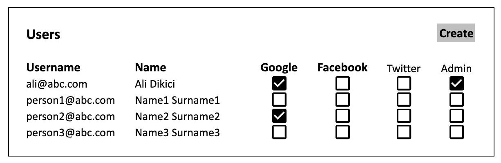
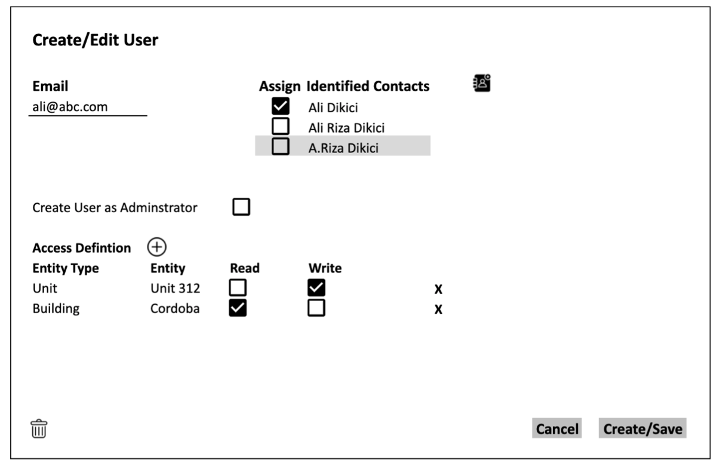
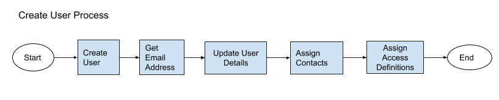

# Definition

User entity in the system represents all the actors/personas of the system's users.

# Properties
User entity corresponts to "user" table in the database which has the following fields:

| Property   | Type   | Reference | Reference To | Description | Method
| ------     | ------ | ------    | ------       | ------      | ------
| id         | Int    | PK        | -            | Unique Identifier|Auto generated
| username   | Text   | -         | -            | -|User entry
| password   | Text   | -         | -            | Hashed password of the user|User entry + Calculation
| google_id  | Text   | -         | -            | Please refer to the sign-in methods section below|Auto Assigned
| facebook_id| Text   | -         | -            | Please refer to the sign-in methods section below|Auto Assigned
| twitter_id | Text   | -         | -            | Please refer to the sign-in methods section below|Auto Assigned
| is_admin   | Bool   | -         | -            | Defines if the user is an administrator|Checkbox

# Sign-in/up Methods
System will provide two separate sign-in methods for the users.

## Sign-in/up with Username & Password
User will be required to enter the credentials to the system as a combination of a username and password pair. As a default username of the user is a valid email address.

## Sign-in/up with Auth Provider
User will be able to sign in and sign up to the system using an authentication provider. Possible authentication providers are listed below:
* Google
* Facebook (Phase 2)
* Twitter (Phase 2)

# Processes

## List

Users are listed in a tabular format as shown on the above screen. All the fields are read-only and click action on the field cells opens the "Editing" User" UI of the system.

Click action on the "Create" button activates the "Create User" process.

## Create/Edit/View

As  can be seen on the “Contact” section of this document, each Contact entity can be bound to a user, and a user entity can be bound to multiple contacts. By using this methodology, system enables users to have multiple roles in the system. Such as, a user can be connected to a company type contact and to an individual type contact. 

When the “Create” button is clicked in the “List Users” process, a modal screen opens and asks for email address of the new user. If there are already existing contacts in the system with the given email address which are not already bound to another user, user can be assigned to one of the listed contacts.

Create user modal screen would be similar to the above screenshot.

On the screenshot above, as the email address is typed, the identified contacts list will be populated.

One or more existing contacts can be assigned to the user by ticking the checkbox.

However, on the screenshot, there is depicted contact with grayed out background. This means that the contact is already assigned to another user.

On this screen  button initiates a “Create Contact” process.

On the access definitions section of this document, user’s access rights are defined.  icon creates a new line in the section and enables a new assignment.

If this modal screen emerged in order to create a user; heading should show “Create User”,  icon should be hidden and the button on the bottom-right corner should show “Create”.

If this modal screen emerged in order to edit a user; heading should show “Edit User”,  icon should be visible and the button on the bottom-right corner should show “Save”.

Click action on the  icon initiates the “Delete User” process.

## Delete

When the  icon is clicked on the details of a user, the system should confirm if the request should proceed. If confirmed, user’s tuple should be deleted from the system database, user table.

