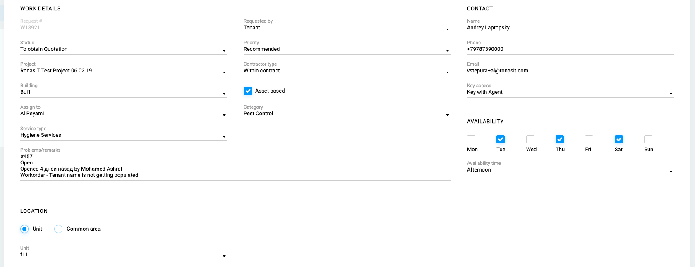

## Definition

A work order is a task or a job for a customer, that can be scheduled and assigned to a [Contact](Contact). Such an order may be from a customer request or created internally within the organization. Work orders may also be created as follow ups to inspections. A work order may be for products or services.

Below is the sample screen for a work order:


## Properties

Work Order entity corresponds to work_orders collection in the database which has the following fields:

```
"id<uuid()>": {
    "requested_by": <Please refer to below description>,
    "status": <Please refer to below description>,
    "priority": <Please refer to below description>,
    "project": <project uuid>,
    "building": <building uuid>,
    "cost_center": <cost_center uuid (Please note, the sample screen doesn't show the cost center)>,
    "service_category": <Please refer to below description>,
    "contractor_type": <Please refer to below description>,
    "is_asset_based": boolean,
    "notes": <Please refer to below description>,
    "location": <Please refer to below description>,
    "unit": <unit uuid>,
    "key_access": <Please refer to below description>,
    "availability": {
        "sunday": {"9to13": boolean, "13to18": boolean, "18to22": boolean},
        "monday": {"9to13": boolean, "13to18": boolean, "18to22": boolean},
        "tuesday": {"9to13": boolean, "13to18": boolean, "18to22": boolean},
        "wednesday": {"9to13": boolean, "13to18": boolean, "18to22": boolean},
        "thursday": {"9to13": boolean, "13to18": boolean, "18to22": boolean},
        "friday": {"9to13": boolean, "13to18": boolean, "18to22": boolean},
        "saturday": {"9to13": boolean, "13to18": boolean, "18to22": boolean}
    }
}
```

### requested_by

A work order can be requested by either one of the below:
* Facilities Manager
* Property Management
* Landlord
* Tenant

The list should be saved under the types collection as a separate object as work_order_requesters.

### status

A work order can have one of the below statuses.
* New work order
* Kaizen Sourcing supplier
* Landlord Sourcing supplier
* To obtain quotation
* Quotation Received
* Quotation sent to landlord
* Quotation approved by landlord
* Subject to review and approval
* Requested to process payment
* Quotation on hold
* Quotation rejected
* Work in progress
* Work in progress - 25%
* Work in progress - 50%
* Work in progress - 75%
* Completed

The list should be saved under the types collection as a separate object as work_order_statuses.

### priority

A work order can have one of the below priorities:
* Emergency
* Preventetive
* Recommended

The list should be saved under the types collection as a separate object as work_order_priorities.

### service_category

Please refer to [Service Category](Service-Category).

### contractor_type

A work order can have one of the below contract types:
* Within contract
* Outside contract

The list should be saved under the types collection as a separate object as work_order_contract_types.

### notes

As described in [Note](Note).

### location

A work order can have one of the below locations:
* Unit
* Common area

The list should be saved under the types collection as a separate object as work_order_locations.

Please note, on the screenshot above, location is a radio buttion, but it should be dropdown.  
If the location is selected as Unit, the unit selection should be enabled, if not, unit selection should be disabled.

### key_access

A work order can have one of the below key accesses:
* Key with agent
* Key with developer
* Key with facility management
* Key with property management
* Key with seller
* Key with security
* Key with tenant
* Key with landlord

The list should be saved under the types collection as a separate object as work_order_key_accesses.

## Processes

### Assign To:

A work order can be assigned to a contact. Contact assignment will be completed with the Contact Assigner component. 

As a side note, if the project has a "Facilities Management Company" defined, and the work order contractor type is "Within contract" the facilities management company will be assigned by default and will be read-only.

If the contractor type is "outside contract" user can assign one of the "Vendor Company" typed contacts to this field filtered by the service category of the work order.

### Contact Assignment:

A site contact should be assigned to work order using the Contact Assigner component.

### Print Work Order:

A work order can be printed. Sample below.

[Work Order Print Out Sample](uploads/workorder5.pdf)